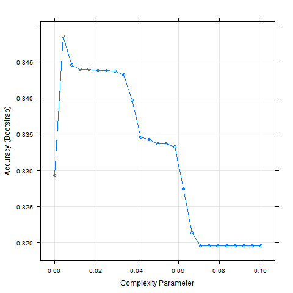
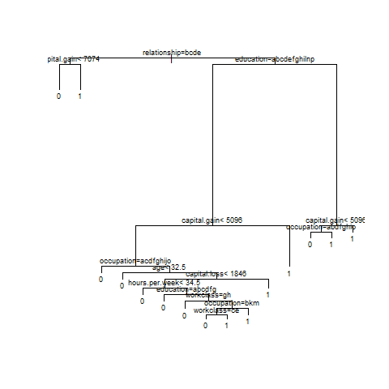

```{r setup, include=FALSE}
knitr::opts_chunk$set(echo = FALSE, warning = FALSE, message = FALSE)
```

```{r loading libraries, include = FALSE}
# Loading required libraries for the project.
if(!require(tidyverse)) install.packages("tidyverse", repos = "http://cran.us.r-project.org")
if(!require(caret)) install.packages("caret", repos = "http://cran.us.r-project.org")
if(!require(rpart)) install.packages("rpart", repos = "http://cran.us.r-project.org")
if(!require(randomForest)) install.packages("randomForest", repos = "http://cran.us.r-project.org")
if(!require(knitr)) install.packages("knitr", repos = "http://cran.us.r-project.org")
if(!require(ggthemes)) install.packages("ggthemes", repos = "http://cran.us.r-project.org")
if(!require(scales)) install.packages("scales", repos = "http://cran.us.r-project.org")


library(tidyverse)
library(caret)
library(rpart)
library(randomForest)
library(knitr)
library(ggthemes)
library(scales)
```

```{r loading datasets and objects, include = FALSE}

# Please note: in order to knit this report, you will need to make sure this Rmd file is located in the same directory where the following # rda files were saved to. These rda files can be created by the script "code.R"  that is supplied as part of this project. # Again, you would need to make sure the rda files are saved in the same directory where this Rmd file is located at in order to knit # this Rmd file by yourself.

load("adult.rda")
load("df.rda")
load("train_set.rda")
load("cp.rda")
load("imp_n_f.rda")
load("imp_w_f.rda")
load("table_acc_all_ensemble.rda")
```

```{r adding income to train_set}
# Re-adding a column "income" into the train_set based on the b_income column.

train_set <- train_set %>%
  mutate(income = ifelse(b_income == 0, "<=50k", ">50k"))
```

```{r digits}
# Setting digit representation options

options(scipen = 100, digits = 7)
```


  
  
___Please note___: The formatting of the document leaves something to be desired, but the formatting issues are unavoidable using R Markdown alone. Said formatting issues can be resolved by incorporating CSS (Cascading Style Sheets) in the Rmd file. As CSS is not taught in this program or a prerequisite, I have not incorporated any CSS into the Rmd file that produces this report.

## 1. **Introduction/Overview**

This section describes the dataset and variables used, and summarizes the goal of the project and key steps performed.

### 1.1 **Dataset**: **[Adult Census Income](https://www.kaggle.com/uciml/adult-census-income)**

The dataset used in this project was the [***Adult Census Income Dataset*** (1994)](https://www.kaggle.com/uciml/adult-census-income). [The website where the dataset was downloaded from](https://www.kaggle.com/uciml/adult-census-income) states:

> "This data was extracted from the 1994 Census bureau database by Ronny Kohavi and Barry Becker (Data Mining and Visualization, Silicon Graphics). A set of reasonably clean records was extracted using the following conditions: ((AAGE>16) && (AGI>100) && (AFNLWGT>1) && (HRSWK>0)). The prediction task is to determine whether a person makes over $50K a year." (UCI Machine Learning, 2016)

The aforementioned conditions used for the extraction of the clean records were:

- **AAGE** - *Age* in integer numbers. The condition AAGE > 16 meant that the age of all people included in the dataset was greater than 16 years old (or a minimal age of 17 years old).

- **AGI** - *Adjusted Gross Income*. The condition AGI > 100 meant that the *Adjusted Gross Income* of all people included in the dataset was greater than $100 (meaning that it was also greater than 0).

- **AFNLWGT** - *Final Weight*. The *Final Weight* was restricted to be greater than 1, meaning that people with final weight of 0 or 1 were not included in the dataset.

- **HRSWK** - *Hours per week*. This variable was restricted to be greater than 0, meaning that all people in the dataset worked more than 0 hours per week.

Each observation (row) in the dataset represented a person, whose income was *less than or equal* to \$50k, or *above* \$50k. 

> ***Please note***: Throughout the document, the symbol $ for US Dollars was occasionally dropped (especially in graphs), and the income is presented as *less than or equal* to 50k, or *above* 50k. This applies also to other sums that appear in USD, such as the sums for *capital gain* and *capital loss*, yet the \$ sign was dropped.

[The dataset was downloaded from **here**](https://www.kaggle.com/uciml/adult-census-income). 

> ***Please note***: In order to download the dataset from ***[Kaggle](https://www.kaggle.com/uciml/adult-census-income)*** you need to have an account on *[Kaggle](https://www.kaggle.com/)*. I have included [the *zip file* for the dataset in my *Github repository* for this project **here**](https://github.com/EW-10/capstone-cyo-work/blob/master/data/census.zip). 

The [zip file *census.zip* contains one file, *adult.csv*](https://github.com/EW-10/capstone-cyo-work/blob/master/data/census.zip), which contains the dataset in a CSV (*Comma-Separated Values*) format.

**The dataset included `r nrow(adult)` observations**. Each observation represented a single person who participated in a survey ([CPS - Current Population Survey](https://www.census.gov/programs-surveys/cps.html)) by the [US Census Bureau](https://www.census.gov/).

[The US Census Bureau states the following regarding the **CPS**](https://www.census.gov/programs-surveys/cps.html):

> "The Current Population Survey (CPS), sponsored jointly by the U.S. Census Bureau and the U.S. Bureau of Labor Statistics (BLS), is the primary source of labor force statistics for the population of the United States." (United States Census Bureau, 2021a)

### 1.2 **Variables**

**The dataset included 14 _predictors_ and 1 categorical _outcome_**. 

#### 1.2.1 **Outcome** \newline

The *income* variable had two levels: "<=50k" and ">50k", for people with *income* *less than or equal* to \$50k, and people with income *above* \$50k, respectively. 

The *income* variable originated from the *AGI* variable in the original [US Census Bureau](https://www.census.gov/) database. 

**AGI** was defined by the [IRS (*Internal Revenue Service*)](https://www.irs.gov/) as follows --

> "Adjusted Gross Income (AGI) is defined as gross income minus adjustments to income. Gross income includes your wages, dividends, capital gains, business income, retirement distributions as well as other income. Adjustments to Income include such items as Educator expenses, Student loan interest, Alimony payments or contributions to a retirement account. Your AGI will never be more than your Gross Total Income on you[r] return and in some cases may be lower." (IRS, 2021)

**The above definition makes it clear that there is a link between _capital gain_ and _income_**, as *capital gain* is included in the definition of *AGI*, which is the variable that *income* is based upon.

When the *Adult Census Income* dataset was extracted from the original [US Census Bureau](https://www.census.gov/) database, the condition "*AGI* > 100" was applied. Therefore, all people included in the dataset had an *Adjusted Gross Income* greater than $100 (and therefore greater than 0).

__When the *Adult Census Income* dataset was created from the original [US Census Bureau](https://www.census.gov/) database, the variable *AGI*, as defined above, was converted to the *income* variable based on two ranges: *income* *less than or equal* to \$50k, and *income* *above* \$50k.__

I replaced the *income* variable in my dataset with a binary variable (*b_income*): 0 for income *less than or equal* to \$50k, and 1 for income *above* $50k. The *income* is the **outcome** that I am trying to predict. The goal was to determine whether a person (represented by an observation, or a row, in the dataset) makes over \$50k a year.

#### 1.2.2 **Predictors** \newline

__The dataset included 14 variables used as *predictors* to predict the *outcome* - whether a person makes over \$50k a year or not__. 

These variables were: ***Age***, ***Workclass***, ***Fnlwgt*** (*Final weight*), ***Education***, ***Education.num***, ***Marital status***, ***Occupation***, ***Relationship***, ***Race***, ***Sex***, ***Capital gain***, ***Capital loss***, ***Hours per week***, and ***Native country***. *Age*, *Final weight*, *Capital gain*, *Capital loss*, and *Hours per week* were ***continuous*** variables. *Education.num* was a ***discrete/ordinal*** variable. The rest were ***categorical*** variables.

###### 1.2.2.1 **Age** had integer values in the range of {`r range(df$age)`}. 

The table below presents a summary of the values in *age*.

```{r summary age}
summary(df$age)
```

###### 1.2.2.2 **Workclass** is the industry in which the person was employed. 

The table below presents a summary of the categories included for this variable and the respective number of observations ("x") in each category. Note this variable included a category of "?" (*unknown* workclass).

`r summary(df$workclass) %>% knitr::kable()`

###### 1.2.2.3 **Fnlwgt** (*Final Weight*) \newline

The following description appears on [the *Kaggle* webpage where this dataset was downloaded from](https://www.kaggle.com/uciml/adult-census-income) --

> "The weights on the Current Population Survey (CPS) files are controlled to independent estimates of the civilian noninstitutional population of the US. These are prepared monthly for us by Population Division here at the Census Bureau. We use 3 sets of controls. These are:

>    "A single cell estimate of the population 16+ for each state.

>    "Controls for Hispanic Origin by age and sex.

>    "Controls by Race, age and sex.

> "We use all three sets of controls in our weighting program and "rake" through them 6 times so that by the end we come back to all the controls we used. The term estimate refers to population totals derived from CPS by creating "weighted tallies" of any specified socio-economic characteristics of the population. People with similar demographic characteristics should have similar weights. There is one important caveat to remember about this statement. That is that since the CPS sample is actually a collection of 51 state samples, each with its own probability of selection, the statement only applies within state." (UCI Machine Learning, 2016)

Despite the description above, there is no clarity as to what *fnlwgt* actually represents. It is said that it represents the number of people that are presumed to share the same characteristics with a particular observation in the dataset. However, when *fnlwgt* is summed up across all observations in the dataset, the total sum equals `r sum(df$fnlwgt)` (more than 6B). Therefore, it is not clear what it actually represents. However, as stated above, this variable is controlled using the above-mentioned three sets of controls, and clearly does not directly link to an actual population estimate. It is also stated above that "[p]eople with similar demographic characteristics should have similar weights", and that "the statement only applies within state". Therefore, although this variable is supposed  to represent demographic characteristics, it does not do so consistently, as "the statement only applies within state". (UCI Machine Learning, 2016)

The [US Census Bureau](https://www.census.gov/) states with regard to *weighting*:

> "The weight for a responding unit in a survey data set is an estimate of the number of units in the target population that the responding unit represents. In general, since population units may be sampled with different selection probabilities and since response rates and coverage rates may vary across subpopulations, different responding units represent different numbers of units in the population. The use of weights in survey analysis compensates for this differential representation, thus producing estimates that relate to the target population." (United States Census Bureau, 2021b)

It also states: "A respondent with a final person weight of 1,682 represents 1,682 people in the U.S. population for the reference month". (United States Census Bureau, 2021b)

The US Census Bureau further states: "Unweighted estimates show distributions for interviewed people only. Using weights means that the distributions are processed so as to be representative of the nation" (United States Census Bureau, 2021c).

This implies that the dataset should be multiplied to include each observation by the number of times that its corresponding *fnlwgt* implies. This was not done as part of the current analysis, and could be done as part of future work. Noting however that the total sum of *fnlwgt* in the dataset was `r sum(df$fnlwgt)` (more than 6B people). 

Therefore, it is not clear how this variable should be applied. Since *fnlwgt* was not applied to each observation in this way (by replicating each observation in accordance with the value associated with *fnlwgt*), the results of this analysis might only apply to the people interviewed, and do not necessarily represent the whole US population. 

The results of my analysis apply to the distributions of people included in the survey that created the dataset (CPS - *Current Population Survey*: 1994 Census Bureau database), and not necessarily to the whole US population.

__Due to lack of clarity with regard to the *fnlwgt* variable, I ran my analyses twice. First, I ran my analyses *without fnlwgt*. I then included *fnlwgt* in my analyses and observed the differences in the results.__

The range of *fnlwgt* was {`r range(df$fnlwgt)`}. It had `r length(unique(df$fnlwgt))` unique values across the dataset. This means that a large number of the `r nrow(df)` observations in the dataset had a unique value of *fnlwgt* associated with them.

###### 1.2.2.4 **Education** represented the highest level of education attained. 

The table below presents a summary of the categories included for this variable and the respective number of observations ("x") in each category.

```{r}
df1 <- df %>% 
  mutate(Education = factor(education, levels = c("Preschool", "1st-4th", "5th-6th", "7th-8th", "9th", "10th", "11th", "12th", "HS-grad",
  "Some-college", "Assoc-voc", "Assoc-acdm", "Bachelors", "Masters", "Prof-school", "Doctorate")))

  summary(df1$Education) %>% 
  knitr::kable()
```

Please note that the dataset mainly included people with education at the levels of HS-grad, Some-college, and Bachelors. This may or may not be representative of the whole US population in 1994. It is questionable whether accurate predictions can be made for those levels of education for which there are very low numbers of observations in the dataset. However, the use of *fnlwgt* should improve the *overall accuracy* of the predictions made.

###### 1.2.2.5 **Education.num** is documented in [*R Package Documentation*](https://rdrr.io/github/coatless/ucidata/man/adult.html) to be the number of years of education in total (Howson, 2019). The range of this variable is {`r range(df$education.num)`}. According to my understanding, it does not represent the number of years of education. It is a numerical representation of the level of education, with a numerical representation from   `r min(train_set$education.num)` to `r max(train_set$education.num)`, for the education levels from *Preschool* to *Doctorate* resepctively. For example, the education level of 1st-4th is listed as *education.num* = 3, which makes it clear that *education.num* does not represent *years of education*, or the category "1st-4th" should have been associated with 4 consecutive different values of *education.num*. *Education.num* should be treated as a categorical variable representing the exact same property as *education*. *Education.num* can be used for ordering the levels of the *education* variable, i.e., Preschool (1) to Doctorate (16).

###### 1.2.2.6 **Martial Status** \newline

The table below presents a summary of the categories included for this variable and the respective number of observations ("x") in each category.

`r summary(df$marital.status) %>% knitr::kable()`

###### 1.2.2.7 **Occupation** \newline

The table below presents a summary of the categories included for this variable and the respective number of observations ("x") in each category. Note this variable included a category of "?" (*unknown* occupation).

`r summary(df$occupation) %>% knitr::kable()`

###### 1.2.2.8 **Relationship** represented the role of the person in the family. 

The table below presents a summary of the categories included for this variable and the respective number of observations ("x") in each category.

`r summary(df$relationship) %>% knitr::kable()`

###### 1.2.2.9 **Race** \newline

The table below presents a summary of the categories included for this variable and the respective number of observations ("x") in each category.

`r summary(df$race) %>% knitr::kable()`

It can be observed from this table that the dataset appears heavily skewed towards *white* people. However, the inclusion of *fnlwgt* may improve the predictions.

###### 1.2.2.10 **Sex** included two categories: *Male* and *Female*. 

The table below presents a summary of the respective number of observations ("x") in each category.

`r summary(df$sex) %>% knitr::kable()`

It can be observed from this table that the dataset appears skewed to include mainly *male* participants. However, the inclusion of *fnlwgt* may improve the predictions.

###### 1.2.2.11 **Capital Gain** represented income from investment sources other than wage/salary. Most individuals in the dataset had *capital gain* = 0. The range of this variable in the dataset was {`r range(df$capital.gain)`}.

###### 1.2.2.12 **Capital Loss** represented losses from investment sources other than wage/salary. Most individuals in the dataset had *capital loss* = 0. The range of this variable in the dataset was {`r range(df$capital.loss)`}.

###### 1.2.2.13 **Hours per Week** represented the number of hours per week the individual worked as an integer value. The range was {`r range(df$hours.per.week)`}.

###### 1.2.2.14 **Native Country** represented the native country (country of origin) of the person interviewed. There were a total of `r df %>% select(native.country) %>% n_distinct` different native countries in the dataset. Note this variable had a category of "?" for unknown native country. Missing values (represented by "?") were included in the analysis and treated as a category by itself "?" - or unknown native country in this case.

**The table below presents the first row of the dataset.** It includes all the variables described above and the column *b_income* which includes a *binary* variable with 0 for income *less than or equal* to \$50k, and 1 for income *above* \$50k. This person is *female*, whose *native country* is the US. Her *income* (represented in the table by *b_income* = 0) is *less than or equal* to $50k.

```{r}
df[1,1:10] %>% knitr::kable()

df[1,11:15] %>% knitr::kable()
```

### 1.3 **Goal**

**To predict whether a person has an income above or below $50k a year using the [1994 US Adult Census Income Dataset](https://www.kaggle.com/uciml/adult-census-income)**.

This included:

- **Training** several algorithms on a train set carved out of the original dataset in order to predict the income (*less than or equal* to \$50k, or *above* \$50k) in a test set that was also carved out of the original dataset.

- **Testing** the performance of each of these algorithms on the test set using *overall accuracy* as an evaluation metric.

### 1.4 **Key Steps**

1.4.1 **Downloading the dataset**: [*Adult Census Income Dataset* (1994)](https://www.kaggle.com/uciml/adult-census-income).

1.4.2 **Exploring the values in this dataset**, including missing values and zero values. 

1.4.3 **Creating a binary variable that stores the income** with 0 for income *less than or equal* to \$50k, and 1 for income *above* \$50k.

1.4.4 **Modeling: The steps below were performed twice: Once with the variable _fnlwgt_ removed from the dataset, and once including the variable _fnlwgt_ in the dataset**.

1.4.4.1 Creating train and test sets based on the original dataset.

1.4.4.2 Training several machine learning algorithms using the inputs in the train set (carved out of the original dataset) to predict *income* (*less than or equal* to \$50k, or *above* \$50k) in the test set (also carved out of the original dataset). These algorithms included the following --

1.4.4.2.1 Linear Regression.

1.4.4.2.2 LDA (Linear Discriminant Analysis).

1.4.4.2.3 KNN (K-Nearest Neighbors) with K = 5.

1.4.4.2.4 RPART (Classification Tree) with *cross-validation* to choose the best "cp" (Complexity Parameter) for the model.

1.4.4.2.5 Random Forest.

1.4.4.2.6 Ensembles: Three ensembles were built to create predictions. These ensembles included: (1) All five models listed above; (2) Four models (not including linear regression), and (3) Three models (not including linear regression and LDA).  

1.4.5 **Using the algorithms trained to predict _income_** (*less than or equal* to \$50k, or *above* \$50k) in the test set. 

1.4.6 __Evaluating my *predictions*__ in comparison with the true values for *income* in the test set using *overall accuracy*.

## 2. **Methods/Analysis**

This section explains the *process and techniques used*, including *data cleaning*, *data exploration and visualization*, *insights gained*, and the *modeling approaches*.

### 2.1 **Process and Techniques Used**

##### 2.1.1 **Data Cleaning** \newline

###### 2.1.1.1 **Data Cleaning of the Original Dataset**

[The original dataset *Adult Census Income*](https://www.kaggle.com/uciml/adult-census-income) was extracted from the 1994 US Census database and had already been cleaned by Barry Becker (Kohavi and Becker, 1996). It was cleaned by Barry Backer using the following conditions: ((AAGE>16) && (AGI>100) && (AFNLWGT>1) && (HRSWK>0)). These conditions meant:

- Age above 16 years old.

- Adjusted Gross Income above $100 (so no observations with *adjusted gross income* = 0 were included).

- Final Weight (*fnlwgt*) above 1 (so no observations with *fnlwgt* = 0 were included).

- Hours per week above 0 (so all observations had a value of *hours per week* greater than zero).

###### 2.1.1.2 **Download of the Dataset**

[The dataset was downloaded from **here**](https://www.kaggle.com/uciml/adult-census-income).

[The zip file *census.zip* was unzipped to obtain the CSV file *adult.csv*](https://github.com/EW-10/capstone-cyo-work/blob/master/data/census.zip).

The CSV file *adult.csv* was read using the function *read_csv* to obtain the object *adult*.

###### 2.1.1.3 **Missing Values**

**The dataset included `r sum(adult == "?")` missing values**. The missing values were in the columns: *Workclass* (`r sum(adult$workclass == "?")` missing values), *Occupation* (`r sum(adult$occupation == "?")` missing values), and *Native country* (`r sum(adult$native.country == "?")` missing values). No other columns had missing values. All of the values that were missing from the *workclass* column, were also missing from the *occupation* column. Seven additional observations (rows) had missing values in the *occupation* column. These seven observations had "Never-worked" in the *workclass* column. All of the observations that had "Never-worked" in the *workclass* column (seven observations) had a missing value in the *occupation* column. 

I elected to leave in the missing values for my analyses, and treated them as a separate category for each of these three variables. The fact that all of the observations that had "Never-worked" in the *workclass* column had a missing value in the *occupation* column indicates these missing values may have a meaning (i.e., a person who "Never-worked" has an "unknown" *occupation*). Also with regard to *native country*, I treated these missing values as a separate category that meant native country unknown. 

Future work could possibly remove all observations with one or more missing values from the dataset before partitioning the dataset to train and test sets. This may improve model performance of the modeling approaches used to predict *income*.

###### 2.1.1.4 **Values Equal to Zero**

**The dataset included `r sum(adult == 0)` values that were equal to zero.** All these values were in the columns *capital loss* and *capital gain*, which included the following number of values equal to zero (out of a total of `r nrow(adult)` observations) --

```{r values zero capital gain capital loss}
zero_capital.gain <- sum(adult$capital.gain == 0)

zero_capital.loss <- sum(adult$capital.loss == 0)

tibble("Capital Gain" = zero_capital.gain, "Capital Loss" = zero_capital.loss) %>% 
  knitr::kable()
```

Therefore, for most observations *capital loss* and *capital gain* were equal to zero. These two columns were included in the analyses nonetheless. As can be seen in the *Results* section (below), these two variables were considered important in the prediction of *income* (even though for most observations they were equal to zero).

###### 2.1.1.5 **Data Wrangling**

The *adult* dataset was saved under the name *census*.

All categorical variables were converted to the class *factor*. The categorical variables were *workclass*, *education*, *marital status*, *occupation*, *relationship*, *race*, *sex*, *native country*, and *income*.

A column *b_income* was added to represent the *income* variable as a binary variable, with 0 for income *less than or equal* to \$50k, and 1 for income *above* \$50k.

The dataset that included all of the 14 *predictors* and the new *outcome* column *b_income* was saved under the name *df*.

The column *income* was removed from this dataset in order to ease the use of different modeling approaches with the formula "*b_income* ~ ." with "**.**" representing all predictors without the need to specify the *predictors* in the formula (and in order for the column *income* not to be considered a *predictor* by error).

As already stated, two separate sets of analyses were run, one without the variable *fnlwgt*, and one including *fnlwgt*.

##### 2.1.2 **Data Exploration and Visualization**  \newline

###### 2.1.2.1 **Variables**

The graphs that follow present the relationship between the different variables and the outcome *income*. 

Notes:

The column *income* with the values <=50k and >50k was re-added into the train set for the purpose of graph presentation, after the analyses had been completed.

The graphs that follow present the data of the train set carved out of the original dataset. The test set was treated as "unknown" until the last stage when each modeling approach was tested on the test set, making *predictions* and evaluating the *overall accuracy* on the test set. Throughout this document, the train set used (mainly for the purpose of graphs) included the variable *fnlwgt*.

The train set was carved out of the original dataset using the function *createDataPartition*, and included 80% of the observations from the original dataset. The partition was done based on the variable *b_income*. The prevalence of each of the two levels of *income* in the original dataset and in the train set are presented below.

2.1.2.1.1 **Income**

For the original dataset, the prevalence (as a percentage) of the two categories of income was:

```{r prevalence income adult}
tab <- adult %>% select(income) %>% table()

(tab/nrow(adult) * 100)
```
For the train set, the prevalence (as a percentage) of the two categories of income was:

```{r prevalence income train set}
tab <- train_set %>% 
           select(income) %>% table()

tab/nrow(train_set) * 100
```
The prevalence is quite similar.

2.1.2.1.2 **Age**

The graph below presents the number of observations in the train set by age for the two levels of income: *less than or equal* to \$50k, and *above* \$50k.

```{r graph age by income}
train_set %>% 
  group_by(income, age) %>% 
  count() %>% 
  ggplot(aes(age, n, col = income)) +
  geom_line(size = 1) +
  xlab("Age") + 
  ylab("Number of observations") +
  labs(col = "Income") +
  ggtitle("Age distribution by income") +
  theme_igray()
```
The graph shows that age distribution was different for the two income categories. For people with income *less than or equal* to \$50k, the most common age range was below 25 years old. For people with income *above* \$50k, the most common age range was between the ages of 30-50. Hence, it can be seen from this graph that age could be used as a *predictor* of *income*.

The graph below presents a summary of the age values for the two levels of income: *less than or equal* to \$50k, and *above* \$50k.

```{r graph age by income2}
train_set %>% group_by(income, age) %>%
  ggplot(aes(income, age, fill = income)) +
  geom_boxplot() +
  xlab("Income") +
  ylab("Age") + 
  labs(fill = "Income") +
  ggtitle("Income by age") +
  theme_igray()
```
It can be easily seen from this graph that on average the age of people who earned *above* \$50k was greater than the age of people who earned *less than or equal* to \$50k. The median age for people who earned *less than or equal* to \$50k was `r train_set %>% filter(b_income == 0) %>% summarize(m = median(age)) %>% pull(m)`. The median age for people who earned above \$50k was `r train_set %>% filter(b_income == 1) %>% summarize(m = median(age)) %>% pull(m)`. Again, this shows that *age* could be used as a *predictor* of *income*.

2.1.2.1.3 **Workclass** \newline

*Workclass* and *occupation* seem to be related. The table below presents *workclass* in the rows vs *occupation* in the columns.

```{r table workclass Vs occupation}
train_set %>% select(workclass, occupation) %>% table()
```

The graph below presents the number of observations for each *workclass* category for the two levels of *income*: *less than or equal* to \$50k, and *above* \$50k.

```{r graph workclass by income}
train_set %>% group_by(income, workclass) %>% count() %>%
  ggplot(aes(workclass, n, fill = income)) + geom_bar(position = "dodge2", stat = "identity") +
  xlab("Workclass") +
  ylab("Number of observations") +
  labs(fill = "Income") + 
  ggtitle("Workclass by income") +
  theme_igray() +
  theme(axis.text.x = element_text(angle = 90, vjust = 0.5, hjust=1))
```
It can be observed from this graph that the missing values (in the column *workclass*) had mainly people with income *less than or equal* to \$50k. The only *workclass* category that had more people with income *above* \$50k than people with income *less than or equal* to \$50k was "Self-emp-inc" (Self-employed - incorporated). For all other *workclass* categories, there was a greater number of people with income *less than or equal* to \$50k than people with income *above* \$50k. The number of people who "Never-worked" or were "Without-pay" was very small (`r sum(train_set$workclass == "Never-worked")` and `r sum(train_set$workclass == "Without pay")` respectively). Based on this graph, *workclass* could be used as a *predictor* of *income*.

2.1.2.1.4 **Occupation**

As already stated and shown, there was a relationship between *occupation* and *workclass*. The graph below presents the number of observations for each *occupation* category for the two levels of income: *less than or equal* to \$50k, and *above* \$50k.


```{r graph occupation by income}
train_set %>% group_by(income, occupation) %>% count() %>%
  ggplot(aes(occupation, n, fill = income)) + geom_bar(position = "dodge2", stat = "identity") +
  xlab("Occupation") +
  ylab("Number of observations") +
  labs(fill = "Income") + 
  ggtitle("Occupation by income") +
  theme_igray() +
  theme(axis.text.x = element_text(angle = 90, vjust = 0.5, hjust=1))
```
Again, as for "unknown" *workclass*, the majority of people with "unknown" *occupation* had *income* *less than or equal* to \$50k. The graph shows that there was a strong relationship between *occupation* and *income*. This makes sense. The greatest number of people with *income* *above* \$50k were in the *occupation* categories of "Exec-managerial" and "Prof-specialty". The next *occupation* categories that had a great number of people with income *above* \$50k were "Sales", "Craft-repair", and "Tech-support". The dataset included a small number of observations for people that were in the "Armed-Forces" (only `r sum(train_set$occupation == "Armed-Forces")` for both classes of income together). In the category "Priv-house-serv" there were no people with *income* *above* \$50k. Most of the observations that had an *occupation* category of "Other-service" had *income* *less than or equal* to \$50k. Based on this graph, *occupation* could be used as a *predictor* of *income*.

2.1.2.1.5 **Final Weight** (*fnlwgt*)

The *adult* dataset included `r length(unique(adult$fnlwgt))` unique values of *fnlwgt*. The meaning of this variable and its relationship with income were unclear, as already discussed. Therefore, I ran my the analyses twice: once without *fnlwgt*, and once with *fnlwgt*. Based on the cleaning criteria used by Barry Becker, all observations in the dataset met the condition *fnlwgt > 1*, therefore no observations with *fnlwgt* = 0 were included. 

The graph below seems to indicate that this variable does not affect *income* significantly (at least not directly, or by itself).

```{r graph fnlwgt by income}
train_set %>% ggplot(aes(income, fnlwgt, fill = income)) + 
  geom_boxplot() +
  xlab("Income") +
  ylab("Final weight") +
  labs(fill = "Income") +
  ggtitle("Income by final weight") +
  theme_igray()
```
This graph indicates that the distribution of *fnlwgt* is similar for the two classes of *income*. It can be noted from this graph that there were more outliers with higher values of *fnlwgt* for *income* *less than or equal* to \$50k. It may or may not be noteworthy that for high values of *fnlwgt* (values above `r train_set %>% filter(income == ">50k") %>% summarize(s = max(fnlwgt)) %>% pull(s)`), these values corresponded to *income* *less than or equal* to \$50k. This may be related to the fact that *fnlwgt* was associated with the number of people in the general population that a certain observation relates to, and a higher number of people in the population had *income* *less than or equal* to \$50k, as is evident in the prevalence of *income* *less than or equal* to \$50k shown above. Other than that, it is not clear from the graph if there is an effect of *fnlwgt* on *income*. This was one of the reasons I ran the analyses first without the *fnlwgt* variable, and then again with the variable *fnlwgt* included, and noted the differences in the results.

The histogram below presents the distribution of *fnlwgt* by income.

```{r histogram fnlwgt}
train_set %>%
  ggplot(aes(fnlwgt, fill = income)) + 
  geom_histogram(col = "black") +
  xlab("Final weight") +
  ylab("Number of observations") +
  labs(fill = "Income") +
  ggtitle("Final weight by income") +
  theme_igray()
```
This graph shows that the distribution of *fnlwgt* was similar between the two classes of *income*, with a greater number of observations for *income* *less than or equal* to \$50k, as is reflected in the prevalence data already presented.

2.1.2.1.6 **Education**

*Education* and *Education.num* represented the same property, as is shown in the table below. *Education* represented the highest level of education attained, and *education.num* was a corresponding numerical representation of the same. 

The table below presents the relationship between the two variables: *education* (rows) and *education.num* (columns). 

```{r table education Vs education.num}
train_set %>% select(education, education.num) %>% mutate(education = factor(education, levels = c("Preschool", "1st-4th", "5th-6th", "7th-8th", "9th", "10th", "11th", "12th", "HS-grad", "Some-college", "Assoc-voc", "Assoc-acdm", "Bachelors", "Masters", "Prof-school", "Doctorate"))) %>% table() %>%
  knitr::kable()
```
This table also shows the greatest number of people had *education* at the levels of "HS-grad", "Some-college", and "Bachelors". Furthermore, it shows that the variable *education.num* was equivalent to the variable *education*. Hence, I did not include a separate graph for *education.num*, and future work could possibly discard this variable.

The graph below presents the relationship between *education* level and *income*.

```{r graph education by income}
train_set %>% mutate(education = factor(education, levels = c("Preschool", "1st-4th", "5th-6th", "7th-8th", "9th", "10th", "11th",
  "12th", "HS-grad", "Some-college", "Assoc-voc", "Assoc-acdm", "Bachelors", "Masters", "Prof-school", "Doctorate"))) %>%  
  group_by(income, education) %>% count() %>%
  ggplot(aes(education, n, fill = income)) + geom_bar(position = "dodge2", stat = "identity") +
  xlab("Education") +
  ylab("Number of observations") +
  labs(fill = "Income") + 
  ggtitle("Education by income") +
  theme_igray() +
  theme(axis.text.x = element_text(angle = 90, vjust = 0.5, hjust=1))
```
This graph shows that the greatest number of people in the dataset had "HS-grad", "Some-college", or "Bachelors" levels of *education*. The graph also shows that for the levels of *education* of "Masters" and above ("Prof-school" and "Doctorate"), there was a greater number of people who earned *above* \$50k, compared to the number of people who earned *less than or equal* to \$50k. For all other levels of *education* there was a greater number of people who earned *less than or equal* to \$50k compared to the number of people who earned *above* \$50k.

2.1.2.1.7 **Relationship**

The variables *relationship* and *marital status* are *connected* to each other, as shown in the table below. *Relationship* is in the rows, and *marital status* is in the columns.

```{r table relationship Vs marital status}
train_set %>% select(relationship, marital.status) %>% table() %>%
  knitr::kable()
```
The graph below presents the number of observations for each *relationship* category for the two levels of income: *less than or equal* to \$50k, and *above* \$50k.

```{r graph relationship by income}
train_set %>% group_by(income, relationship) %>% count() %>%
  ggplot(aes(relationship, n, fill = income)) + geom_bar(position = "dodge2", stat = "identity") +
  xlab("Relationship") +
  ylab("Number of observations") +
  labs(fill = "Income") + 
  ggtitle("Relationship by income") +
  theme_igray() +
  theme(axis.text.x = element_text(angle = 90, vjust = 0.5, hjust=1))
```
The graph shows a strong connection between *relationship* and *income*. There were significantly more married people (husband or wife) that had *income* *above* \$50k. For all other categories of this variable, there was a significantly greater number of people with *income* *less than or equal* to \$50k than people with *income* *above* \$50k. Note that for "Wife" even more so than for "Husband", the numbers of wives with *income* *less than or equal* to \$50k and *above* \$50k were almost equal. This is an interesting finding especially as it is shown later that males are more likely to have *income* *above* \$50k in comparison with females. It should also be noted that the dataset included a relatively small number of wives, so this finding should be treated with caution. Based on this graph, *relationship* could be used as a *predictor* of *income*, specifically with the two categories of married ("Husband" or "Wife") versus the remaining categories.

2.1.2.1.8 **Marital Status**

This variable included the following categories: `r levels(train_set$marital.status)`.

The graph below presents the number of observations in each category for the two levels of income: *less than or equal* to \$50k, and *above* \$50k.

```{r graph marital status by income}
train_set %>% group_by(income, marital.status) %>% count() %>%
  ggplot(aes(marital.status, n, fill = income)) + geom_bar(position = "dodge2", stat = "identity") +
  xlab("Marital Status") +
  ylab("Number of observations") +
  labs(fill = "Income") + 
  ggtitle("Marital Status by income") +
  theme_igray() +  
  theme(axis.text.x = element_text(angle = 90, vjust = 0.5, hjust=1))
```
This graph shows that there is a significantly greater married people who have *income* *above* \$50k. For all other categories there was a greater number of people with *income* *less than or equal* to \$50k compared to the number of people with *income* *above* \$50k. Based on this graph, this variable could be used as a *predictor* of *income*.

2.1.2.1.9 **Race**

This variable included the following categories: `r levels(train_set$race)`.

The graph below presents the number of observations for each category for the two levels of income: *less than or equal* to \$50k, and *above* \$50k.

```{r graph race by income}
train_set %>% group_by(income, race) %>% count() %>%
  ggplot(aes(race, n, fill = income)) + geom_bar(position = "dodge2", stat = "identity") +
  xlab("Race") +
  ylab("Number of observations") +
  labs(fill = "Income") + 
  ggtitle("Race by income") +
  theme_igray() +
  theme(axis.text.x = element_text(angle = 90, vjust = 0.5, hjust=1))
```
This graph shows that the great majority of the observations were of people who were "White". The second largest group of people included in the dataset were "Black". The graph also shows that for all groups of people there was a greater number of people with *income* *less than or equal* to \$50k (this is reflected in the prevalence of *income* previously presented). There was a greater number (and greater proportion) of "White" people with *income* *above* \$50k in comparison with all other categories. Although the great majority of observations were of "White" people, this variable seems to have an effect on *income*, with "White" people more likely to have *income* *above* \$50k.

In order to be able to observe *race* categories other than "White", the same graph is presented again below with a *log scale* on the y-axis. Note the corresponding number of observations for each bar on the y-axis. The height of different bars in the graph below could not be directly compared due to the *log scale* on the y-axis, but this scale more easily allows the small number of observations for each of the other *race* categories other than "White" to be assessed.

```{r graph race by income2}
train_set %>% group_by(income, race) %>% count() %>%
  ggplot(aes(race, n, fill = income)) + geom_bar(position = "dodge2", stat = "identity") +
  scale_y_log10() +
  xlab("Race") +
  ylab("Number of observations") +
  labs(fill = "Income") + 
  ggtitle("Race by income (log scale)") +
  theme_igray() +
  theme(axis.text.x = element_text(angle = 90, vjust = 0.5, hjust=1))
```
The graph below presents the relationship between *race* and *income* for the two *sex* categories, "Male" and "Female".

```{r graph race by income by sex}
train_set %>% group_by(income, race, sex) %>% count() %>%
  ggplot(aes(race, n, fill = income)) + geom_bar(position = "dodge2", stat = "identity") +
  xlab("Race") +
  ylab("Number of observations") +
  labs(fill = "Income") + 
  ggtitle("Race by sex by income") +
  facet_wrap(~ sex) +
  theme_igray() +
  theme(axis.text.x = element_text(angle = 90, vjust = 0.5, hjust=1))
```
This graph shows that although more males were included in the dataset in comparison with females, a similar relationship between *race* and *income* exists for both *sex* categories. This graph also shows that a greater proportion of "White", "Black" and "Asian-Pacific-Islander" males had *income* *above* \$50k, in comparison with females of the same *race* categories. Although the dataset included significantly more males than females, there was a disproportionate proportion of "Black" females, with more "Black" females than "Black" males included in the dataset. The graph also shows that "White" males were significantly more likely to have *income* *above* \$50k in comparison with "White" females.

The graph below presents the relationship between *race*, *age*, and *income* for the two *sex* categories, "Male" and "Female". In the graph it is not easy to observe the number of observations for each category, although darker dots represent a larger number of observations for that category.

```{r graph race by age by sex by income}
train_set %>% ggplot(aes(age, race, col = income)) + 
  facet_wrap(~ sex) + geom_point(alpha = 0.5) +
  xlab("Age") +
  ylab("Race") +
  labs(col = "Income") +
  theme_igray()
```
This graph also shows that for most ages, there were more males with *income* *above* \$50k in comparison with females, for all *race* categories included in the dataset. The graph demonstrates an interaction between different predictors (*age*, *sex*, and *race*). This pattern of interaction suggests that modeling using modeling approaches other than linear regression or LDA, which may incorporate interaction between different predictors into the model, could provide better *overall accuracy* in comparison with linear regression or LDA. 

A machine learning book by Molnar states:

> "When features interact with each other in a prediction model, the prediction cannot be expressed as the sum of the feature effects, because the effect of one feature depends on the value of the other feature." (Molnar, 2021)

This statement means that linear regression and LDA (which both use a linear combination, or sum of *feature* effects) would not be the best modeling approaches for this dataset, which includes interaction between different *predictors* (*features*).

2.1.2.1.10 **Sex**

The graph below presents the number of observations for each *sex* category for the two levels of income: *less than or equal* to \$50k, and *above* \$50k.

```{r graph sex by income}
train_set %>% group_by(income, sex) %>% count() %>%
  ggplot(aes(sex, n, fill = income)) + geom_bar(position = "dodge2", stat = "identity") +
  xlab("Sex") +
  ylab("Number of observations") +
  labs(fill = "Income") + 
  ggtitle("Sex by income") +
  theme_igray()
```
This graph shows that more males were included in the dataset in comparison with females. The graph also shows that a greater number and proportion of males had *income* *above* \$50k in comparison with *females*. This graph suggests that *sex* could be used as a *predictor* of *income*.

The graph below presents the *age* distribution for each *sex* category for the two levels of *income*: *less than or equal* to \$50k, and *above* \$50k.


```{r graph age by sex by income}
train_set %>% group_by(income, sex) %>%
  ggplot(aes(income, age, fill = income)) + 
  geom_boxplot() +
  xlab("") +
  ylab("Age") +
  labs(fill = "Income") + 
  ggtitle("Age by sex by income") +
  facet_wrap(~ sex) +
  theme_igray()
```
This graph shows that for both sexes, people with *income* *above* \$50k were older in comparison with people with *income* *less than or equal* to \$50k. The graph also shows that females with *income* *less than or equal* to \$50k spanned a greater age range in comparison with males with *income* *less than or equal* to \$50k. Males with *income* *above* \$50k were on average older than females with *income* *above* \$50k.

2.1.2.1.11 **Capital Gain**

This variable represented *income* from investment sources, apart from wages/salary. The great majority of observations in the dataset had *capital gain* = zero (`r mean(train_set$capital.gain == 0) * 100`% of them). 

The histogram below presents the number of observations per *capital gain* for the two levels of income: *less than or equal* to \$50k, and *above* \$50k. Note the *log scale* on the y-axis. __Please note the axis labels on the y-axis do not match the actual numbers. This is a known issue with log scale for stacked histograms. These labels should be ignored. However, the proportion of observations with *income* *less than or equal* to and *above* \$50k can be understood from this histogram__.

```{r graph capital gain by income}
train_set %>%
  ggplot(aes(capital.gain, fill = income)) + geom_histogram(col = "black") +
  scale_y_log10(labels = comma) +
  xlab("Capital Gain") +
  ylab("Number of observations") +
  labs(fill = "Income") +
  ggtitle("Capital Gain by income (log scale)") +
  theme_igray()
```
This histogram shows that when *capital gain* is 0, or *capital gain* is below circa 12000, the majority of the observations had *income* *less than or equal* to \$50k. For *capital gain* above circa 12000, almost all observations had *income* *above* \$50k. Although most observations had *capital gain* = 0 (`r mean(train_set$capital.gain == 0) * 100`% of all observations in the train set, including both *income* levels), it seems from this histogram that *capital gain* could be used as a *predictor* of *income*.

2.1.2.1.12 **Capital Loss**

This variable represented losses from investment sources, apart from wages/salary. The great majority of observations in the dataset had *capital loss* = zero (`r mean(train_set$capital.loss == 0) * 100`% of them). 

The histogram below presents the number of observations per *capital loss* for the two levels of *income*: *less than or equal* to \$50k, and *above* \$50k. Note the *log scale* on the y-axis. __Please note the axis labels on the y-axis do not match the actual numbers. This is a known issue with log scale for stacked histograms. These labels should be ignored. However, the proportion of observations with *income* *less than or equal* to and *above* \$50k can be understood from this histogram__.

```{r graph capital loss by income}
train_set %>%
  ggplot(aes(capital.loss, fill = income)) + geom_histogram(col = "black") +
  scale_y_log10(labels = comma) +
  xlab("Capital Loss") +
  ylab("Number of observations") +
  labs(fill = "Income") +
  ggtitle("Capital Loss by income (log scale)") +
  theme_igray()
```
Note the difference between the histogram above representing *capital loss* by income versuss the previous histogram representing *capital gain* by income. There is much more variability in the histogram representing *capital loss* in comparison with the previous histogram representing *capital gain*. Specifically, noting the *log scale* on the y-axis (and ignoring the actual labels for the reasons already stated), for the majority of people who had *capital loss* = 0, most of them had *income* *less than or equal* to \$50k. For people whose *capital loss* was greater than 0 and less than circa 1500, all of them had *income* *less than or equal* to \$50k. For people whose *capital loss* was between circa 1500 and 3000, some of them had *income* *less than or equal* to \$50k and some of them had *income* *above* \$50k. For people whose *capital loss* was above circa 3000, all of them had *income* *less than or equal* to \$50k. Therefore, although it seems that *capital loss* affects *income*, its relationship with *income* is somewhat more complex in comparison with the relationship between *capital gain* and *income*. Although it could be used as a *predictor* of *income*, it seems to be a weaker *predictor* in comparison with *capital gain*. Again, note that the great majority of observations had *capital loss* = 0 (`r mean(train_set$capital.loss == 0) * 100`% of the observations in the train set, including both levels of *income*).

2.1.2.1.13 **Hours per week**

This variable represented the amount of hours worked per week. 

The histogram below presents the number of observations by *hours per week* for the two levels of *income*: *less than or equal* to \$50k, and *above* \$50k. Note the *log* scale on the y-axis. __Please note the axis labels on the y-axis do not match the actual numbers. This is a known issue with log scale for stacked histograms. These labels should be ignored. However, the proportion of observations with *income* *less than or equal* to and *above* \$50k can be understood from this histogram__.

```{r graph hours per week by income}
train_set %>%
  ggplot(aes(hours.per.week, fill = income)) + 
  geom_histogram(col = "black") +
  scale_y_log10(labels = comma) +
  xlab("Hours per week") +
  ylab("Number of observations") +
  labs(fill = "Income") +
  ggtitle("Hours per week by income (log scale)") +
  theme_igray()
```
This histogram shows that for all values of *hours per week* there were observations with either level of *income* *less than or equal* to \$50k or *above* \$50k. The distribution of *hours per week* seems to be similar between the two levels of *income*. Note that the proportions of people with *income* *less than or equal* to \$50k, and *above* \$50k could not be deduced directly from this histogram, due to the *log scale* on the y-axis. This histogram shows that the distribution of the number of *hours per week* was similar for the two levels of income, *less than or equal* to \$50k and *above* \$50k. The majority of people for both *income* levels worked between circa 35-60 hours per week. Note that the data cleaning done by Barry Becker (Kohavi and Becker, 1996) guaranteed that no observations in the dataset had *hours per week* = 0. Therefore, the lowest number of *hours per week* in the histogram above signifies *hours per week* that are greater than zero (the lowest number of *hours per week* in the train set was `r min(train_set$hours.per.week)`). Note that for observations that had the lowest range of *hours per week* (the left-most bar of the histogram above), none of them had *income* *above* \$50k.

The histogram below presents the same data as above for *hours per week*, but without the *log scale* on the y-axis.

```{r graph hours per week by income2}
train_set %>%
  ggplot(aes(hours.per.week, fill = income)) + 
  geom_histogram(col = "black") +
  xlab("Hours per week") +
  ylab("Number of observations") +
  labs(fill = "Income") +
  ggtitle("Hours per week by income (actual scale)") +
  theme_igray()
```
This histogram shows that the great majority of people worked circa 35-40 *hours per week*. The histogram also shows that people who worked less than circa 18 *hours per week*, none of them had *income* *above* \$50k. It also shows that for people who worked for circa 18-30 *hours per week*, a very small number of them had *income* *above* \$50k. For people who worked circa 50 or more *hours per week*, there was a significant proportion of them that had *income* *above* \$50k. There were very few people that worked more than circa 70 *hours per week*, and it is noted that due to the small number of observations it is hard to see the bars representing these people in the following histogram. However, these people can be observed in the immediately preceding histogram for the same data with a *log scale* on the y-axis.

The graph below presents *hours per week* by *age* with color representing the level of *income*.

```{r graph hours per week by age by income}
train_set %>% 
  ggplot(aes(age, hours.per.week, col = income)) + 
  geom_point(alpha = 0.8) +
  xlab("Age") +
  ylab("Hours per week") +
  labs(col = "Income") +
  ggtitle("Hours per week by age by income") +
  theme_igray()
```
This graph shows that although there appears to be a relationship between these two variables and *income*, this relationship is non-linear. Therefore, a boundary of a line would not be the best boundary between the two classes of income. This indicates that modeling approaches that are based on a linear combination of *features* i.e. linear regression and LDA (Linear Discriminant Analysis) would not be the best modeling approaches in this case. Nonetheless, these methods were used as baseline modeling approaches before trying more complex modeling approaches as detailed below in the *Modeling Approaches* sub-section. The non-linear relationship between these two variables and *income* could be observed in the graph above.


2.1.2.1.14 **Native Country**

The *native country* of the great majority of people in the dataset was the "United States" (`r mean(train_set$native.country == "United-States") * 100`%). Since the *native country* of most people in the dataset was the United States, this variable would probably not be a strong *predictor* of *income* since its variability is very low. The native countries that appear in the dataset included: `r levels(train_set$native.country)`. Note the countries "South" and "Hong". It is not clear what "South" represents (maybe South Korea or South Africa). "Hong" probably represents Hong Kong. Note that `r sum(train_set$native.country == "?")` of the observations had "?" (unknown) *native country*.

The graph below presents the number of observations for each *native country* included in the dataset for the two levels of income: *less than or equal* to \$50k, and *above* \$50k. Note the *log scale* on the y-axis.

```{r graph native country by income}
train_set %>% group_by(income, native.country) %>% count() %>%
  ggplot(aes(native.country, n, fill = income)) + geom_bar(position = "dodge2", stat = "identity") +
  scale_y_log10() +
  xlab("Native Country") +
  ylab("Number of observations") +
  labs(fill = "Income") + 
  ggtitle("Native Country by income") +
  theme_igray() +
  theme(axis.text.x = element_text(angle = 90, vjust = 0.5, hjust=1))
```
The *native country* of most people (`r mean(train_set$native.country == "United-States") * 100`%) in the dataset was the United States for both levels of *income*. The graph shows a difference in the proportions (note the *log scale* on the y-axis) of people with *income* *above* \$50k or *less than or equal* to \$50k for people from different native countries. The height of different bars could not be directly compared due to the *log scale* on the y-axis that was selected in order to enable viewing of all values for different native countries on the same graph. Since the *native country* of most people was the United States, and small numbers of people came from another *native country*, and since for all *native countries* there were more people with *income* *less than or equal* to \$50k, it is not clear to what extent this variable could be used as a *predictor* of *income*. Nonetheless, it was included in the dataset for the analyses conducted. Future work could possibly discard this variable and run analyses without it, and observe the effect on model performance (*overall accuracy* of the models used). Note again the *log scale* on the y-axis that makes comparisons of bar heights difficult. Note also that for a small number of native countries, all observations had *income* *less than or equal* to \$50k. However, due to the small number of observations for these native countries, again the predictive power of this variable may be low.

##### 2.1.3 **Insights Gained** \newline 

Data exploration and visualization revealed the following effects --

Most of the variables included in the dataset had some effect on *income*. Some had a more discernible effect, and some had a less discernible effect.

2.1.3.1 **Age**: On average, the age of people with *income* *above* \$50k was greater than the age of people with *income* *less than or equal* to \$50k.

2.1.3.2 **Workclass**: This had an effect on *income*. The majority of the observations were related to people in the *private* sector. The only *workclass* that had more people with *income* *above* \$50k in comparison with people with *income* *less than or equal* to \$50k was the *Self-employed-incorporated* sector. There was a significant difference in the *income* distribution between people defined as *Self-employed-incorporated* (more people with *income* *above* \$50k) in comparison with *Self-employed-not-incorporated* (more people with *income* *less than or equal* to \$50k).

2.1.3.3 **Occupation**: This had a very discernible effect on *income*. The greatest numbers of people with *income* *above* \$50k were in the *Exec-Managerial* and *Prof-specialty* occupations. Other occupations that had a significant proportion of people with *income* *above* \$50k were *Tech-support* and *Sales*.

2.1.3.4 **Education**: This had a very discernible effect on *income*. For *education* of *Masters* and above, there was a greater number of people with *income* *above* \$50k in comparison with people with *income* *less than or equal* to \$50k. For *Bachelors* there was a significant proportion of people with *income* *above* \$50k, although the number of people with *income* *less than or equal* to \$50k was still greater for people with *Bachelors*.

2.1.3.5 **Relationship**: This had an effect on *income*. There was a significantly greater proportion of people with *income* *above* \$50k for people who were married (*husband* or *wife*).

2.1.3.6 **Marital Status**: This had an effect on *income*. The greatest proportion of people with *income* *above* \$50k was for people who were married to a *civilian* spouse. There was a very small number of people who were married to an *Armed Forces* spouse. This implies that it may be a good idea to group together both married categories into a single married category. This could be done as part of future work.

2.1.3.7 **Race**: The great majority of participants were *white*. The other *race* categories each had a very small number of observations. Nonetheless, it could be observed from the graph that a greater proportion of *white* participants had *income* *above* \$50k in comparison with participants of other *race* categories. Because the great majority of the participants were *white*, the ability for this variable to be a *predictor* of *income* may be questionable. Future work could possibly run the analyses after discarding this variable, and evaluate model performance (*overall accuracy*) of the modeling approaches used.

2.1.3.8 **Sex**: This had an effect on *income*. There was a greater proportion of males with *income* *above* \$50k in comparison with females. Most participants were males. The dataset seemed *skewed* towards a higher prevalence of males in comparison with the total population. This may impede the ability to use *sex* as a *predictor* of *income* based on this dataset. Future work could possibly discard this variable and run the analyses without it to observe the effect on model performance (*overall accuracy*) of the modeling approaches used. 

A modeling approach such as **Naive Bayes** could be used so the prevalence of females could be forced to be higher for the model calculations. The data science book by Prof. Irizarry (2019) states:

> "One useful feature of the Naive Bayes approach is that it includes a parameter to account for differences in prevalence."

> "The Naive Bayes approach gives us a direct way to correct this since we can simply force $\pi$ to be whatever value we want it to be."

This could be done as part of future work. The Naive Bayes modeling approach could be used and the prevalence of females forced to be higher in order to achieve a better balance of sensitivity and specificity.

2.1.3.9 **Capital Gain**: This had a discernible effect on *income*. Although most participants had *capital gain* = 0 (`r mean(train_set$capital.gain == 0) * 100`%), *capital gain* had a significant effect on *income*, where people with *capital gain* above circa 12000 mostly had *income* *above* \$50k.

2.1.3.10 **Capital Loss**: This had a less discernible effect on *income*, although it did still have an effect on it. For the majority of people who had no capital loss (*capital loss* = 0), most of them had *income* *less than or equal* to \$50k, although a significant number of them also had *income* *above* \$50k. For people who had a *capital loss* greater than 0 and below circa 1500, all of them had *income* *less than or equal* to \$50k. For people who had *capital loss* between circa 1500 and 3000, some of them had *income* *above* \$50k and some had *income* *less than or equal* to \$50k. For people who had *capital loss* greater than circa 3000, all of them had *income* *less than or equal* to \$50k. Thus, *capital loss* could be used as a *predictor* of *income*, although the relationship between them was rather complex.

2.1.3.11 **Hours per week**: This had a discernible effect on *income*. People who worked less than circa 35 hours per week rarely had *income* *above* \$50k. People who worked less than circa 18 hours per week were extremly unlikely to have an *income* *above* \$50k. For people who worked circa 50-70 hours per week, there was a significant proportion of them with *income* *above* \$50k. There was only small number of people who worked more than 70 hours per week.

2.1.3.12 **Native Country**: The *native country* of the great majority of participants was the United States. Only relatively small numbers of people came from any of the other country. Therefore, the effect of *native country* on *income* was questionable. Future work could possibly discard this variable and run the analyses without it and evaluate model performance (*overall accuracy*) of the modeling approaches used.

2.1.3.13 **Final Weight** (*fnlwgt*): This variable is qualitatively different than the other variables in the dataset. It vaguely represented demographic characteristics, which may be different between different states included in the survey (CPS - Current Population Survey). The relationship of this variable with *income* was unclear. Despite that, the US Census Bureau (2021b) declared the importance of this variable. This variable may need to be used in a different way to the other variables. This could be done by replicating each observation in the dataset to the value of *fnlwgt* associated with it. This could be done as part of future work. It should be noted that the total sum of *fnlwgt* for all observations in the dataset is greater than 6 Billion, a number that is obviously very much greater than the US population. It was stated in the [description of the dataset](https://www.kaggle.com/uciml/adult-census-income) that observations with a similar *fnlwgt* should have similar demographic characteristics (UCI Machine Learning, 2016). [It was also stated there](https://www.kaggle.com/uciml/adult-census-income) that "since the CPS sample is actually a collection of 51 state samples, each with its own probability of selection, the statement only applies within state" (ibid.). Based on this, I elected to run my analyses twice, once *without* *fnlwgt*, and once *including* *fnlwgt*. The results of these two sets of analyses appear in the *Results* section below.

**Summary**: 

The following variables had a significant effect on *income* -- *Age*, *Workclass*, *Occupation*, *Relationship*, *Marital Status*, *Capital Gain*, and *Hours per Week*. *Sex* and *Capital Loss* also had some effect on *income*. The great majority of participants had *capital gain* and *capital loss* equal to zero. The dataset was *skewed* with regard to *sex* with the great majority of the participants being male. Nonetheless, *sex* had an effect on *income*. For the variables *race* and *native country*, the great majority of participants were *white* people whose *native country* was the United States. This makes these two variables less able to be used for prediction of *income*, due to the skewness of the dataset in this regard. The interpretation of the variable *fnlwgt* and its relationship to *income* were not altogether clear. Therefore, the analyses were run twice: once without *fnlwgt*, and once including *fnlwgt*. The variable *education.num* was found to represent the exact same property as *education* and could therefore be discarded as part of future work. This variable could still be used to order the levels of *education*, i.e. "HS-grad" = 9, etc.

Based on *data exploration and visualization*, future work could possibly discard the variables *race* and *native country*, and run the analyses without them. Also, future work could possibly group together some of the levels of some of the categorical variables, i.e., by creating two categories for the variable *relationship*: married and unmarried/other. For the variable *marital status* similar grouping could take place with a married category that combines both married to a civilian spouse and married to an Armed Forces spouse.

__The effects different variables had on income were very interesting. The type of effects different variables had varied greatly. *Data exploration and visualization* allowed me to have a deeper understanding of the dataset and the different effects of different variables on *income*.__

__Observing the level of effects different variables had on *income* allowed me to consider discarding some of the variables, as well as grouping together some of the levels of other variables. This could be done as part of future work.__

##### 2.1.4 **Modeling Approaches** \newline

Based on *data exploration and visualization*, I elected to include all variables in my analyses. Although as explained above, future work could consider discarding some of them and grouping together categories of some other variables. Due to reasons previously explained, I elected to run my analyses twice: once without *fnlwgt*, and once with *fnlwgt*.

Future work could consider discarding the following variables, based on *data exploration and visualization* --

- *Education.num*: It essentially duplicates the variable *education*.

- *Native Country*: The *native country* of most participants was the United States, and only a small number of them came from any other country.

- *Race*: Most participants were "White", and only a small number of participants from other *race* categories were included in the dataset.

Future work could also group together some of the categories for some of the categorical variables, as discussed in the previous sub-section.

The modeling approaches presented below were trained on the train set and were then used to make *predictions* of *income* for the test set.

*Cross-validation* for optimizing the parameters of a modeling approach was done only for the RPART (Classification Tree) model, for the parameter "cp" (Complexity Parameter). I did attempt to optimize the parameters of other modeling approaches used, but seemingly due to the age and modest specification of my computer, I was unable do so. Future work, maybe using a newer computer, could possibly run cross-validation to optimize the parameters of other modeling approaches used and evaluate the effect of tuning these parameters on the *overall accuracy* of the modeling approaches used.

###### 2.1.4.1 **Datasets** 

Train and test sets were carved out of the original dataset using the function *createDataPartition*. These sets were used to train and test the modeling approaches used. Eighty percent of the original dataset was included in the train set, and 20% of the original dataset was included in the test set.

The data science book by Prof. Irizarry (2019) states:

> "A standard way of generating the training and test sets is by randomly splitting the data. The caret package includes the function createDataPartition that helps us generates indexes for randomly splitting the data into training and test sets".

> "[...]we carve out a piece of our dataset and pretend it is an independent dataset: we divide the dataset into a training set [...] and a test set [...]. We will train our algorithm exclusively on the training set and use the test set only for evaluation purposes."

> "We usually try to select a small piece of the dataset so that we have as much data as possible to train. However, we also want the test set to be large so that we obtain a stable estimate of the loss without fitting an impractical number of models. Typical choices are to use 10%-20% of the data for testing."

I chose to use 80% of the data for training, in order to "have as much data as possible to train", and at the same time use 20% of the data for testing, in order for "the test set to be large" so that I "obtain a stable estimate of the loss" (Irizarry, 2019). Therefore, I chose to use 80% of the data for training (the train set), and 20% of the data for testing (the test set).

###### 2.1.4.2 **Modeling Approaches Used**

The modeling approaches used included Linear Regression, LDA (Linear Discriminant Analysis), KNN (K-Nearest Neighbors), RPART (Classification Tree), Random Forest and building Ensembles based on majority voting.

2.1.4.2.1 **Linear Regression**: This modeling approach was used as a baseline approach, to which the performance of later and more complex modeling approaches was compared. This method is quite rigid and has a few disadvantages with relation to my data. Specifically, it predicts based on a linear combination of the predictors, assuming the same relationship between the predictors and the outcome (*income*) persists throughout the range of the dataset. This assumption does not necessarily hold, as can be seen for several of the predictors, i.e., *capital loss*. Linear regression was used as a baseline modeling approach to predict the conditional probability of *income* *less than or equal* to \$50k, and *income* *above* \$50k (0 or 1 respectively, for the binary outcome variable *b_income*), depending on all the *predictors* in the dataset. It was run twice: once without *fnlwgt* and once with *fnlwgt*. A decision rule that was defined as *p* > 0.5 predicted an *income* *above* \$50k (with *p* representing the conditional probability computed using the function *predict*).

2.1.4.2.2 **LDA** (Linear Discriminant Analysis): This method finds "a linear combination of features that characterizes or separates two or more classes of objects or events" (Wikipedia, 2021). It "is closely related to [...] regression analysis, which also attempt to express one dependent variable as a linear combination of other features or measurements" (ibid.). A fundamental assumption of this modeling approach is that "independent variables are normally distributed" (ibid.). This assumption does not necessarily hold for all variables in the dataset. "LDA explicitly attempts to model the difference between the classes of data." (ibid.) LDA assumes the conditional distributions of the *predictors* for the different classes of outcome (in this case, *income* *less than or equal* to \$50k and *income* *above* \$50k) are normal and that "the correlation structure is the same for all classes, which reduces the number of parameters we need to estimate." (Irizarry, 2019) Again, these assumptions do not necessarily hold for all variables in the dataset. LDA forces the assumption that all *predictors* share the same standard deviations and correlations. Thus, the boundary between classes with this method is a line. For this reason, this method is called *linear discriminant analysis*. The lack of flexibility does not permit the capture of the non-linearity in the true conditional probability function. As stated above for linear regression, the relationship between several of the *predictors* and *income* was non-linear, and a line would not be the best boundary between classes (see graphs above, i.e. a graph of the relationship between *capital loss* and *income*, and a graph of *hours per week* by *age* with color representing *income*). Nonetheless, this modeling approach was used as a second baseline method to create predictions after linear regression.

2.1.4.2.3 **_k_-NN** (*k*-nearest neighbors): This was the third modeling approach used to create predictions. This method created predictions for the conditional probability as follows -- For any point represented by a certain combination of the *predictors*' values (an observation), the *k*-nearest points were identified, and an average of the 0s and 1s (for the binary outcome variable *b_income*) associated with these points was taken. The set of points (or observations) used to compute the average are referred to as the *neighborhood*. *k* = 5 was used for this modeling approach. As previously explained, due to the age and modest specification of my computer it failed to run *cross-validation* to select the best parameter *k* for this modeling approach, therefore *k* = 5 was used, which is a standard choice, and the default parameter for this method. 

2.1.4.2.4 **RPART** (Classification/Decision Tree): This forms predictions by calculating which class is the most common among the train set observations within the partition. 

The data science book by Prof. Irizarry (2019) describes classification/decision trees as follows --

> "A tree is basically a flow chart of yes or no questions. The general idea of the methods we are describing is to define an algorithm that uses data to create these trees with predictions at the ends, referred to as nodes. Regression and decision trees operate by predicting an outcome variable Y by partitioning the predictors."

> "Classification trees, or decision trees, are used in prediction problems where the outcome is categorical."

> "[W]e form predictions by calculating which class is the most common among the training set observations within the partition".

Based on *data exploration and visualization*, it seemed that for most *predictors*, classification/decision trees could work pretty well. These trees would divide the predictor space based on certain values of the predictors. 

The graph presented below indicates that classification trees could perform well on the dataset. This graph shows the interaction between the predictors *relationship* and *capital gain*. There are two different thresholds for *capital gain* that predict *income* *above* \$50k: one threshold for people who are married (husband or wife) and another threshold for people who are not married (all other categories). 

*Please note*: The levels of the horizontal dashed lines were chosen based on the decision rules of the RPART classification tree that is presented in the *Results* section below. These lines mark the thresholds of *capital gain* for *income* *above* \$50k for people who are married (the lower threshold) and for people who are not married (the higher threshold). In this graph, the threshold is particularly clear for the "Husband" category, as the "Wife" category does not have many observations with *capital gain* between the two dashed lines). Also note, the darker the point the greater the number of observations it represents.

```{r graph capital gain by relationship by income}
 train_set %>% ggplot(aes(relationship, capital.gain, col = income)) + 
  geom_point(alpha = 0.5) + 
  scale_y_continuous(limits = c(0, 30000)) + 
  geom_hline(aes(yintercept = 7074), lty = 2) + 
  geom_hline(aes(yintercept = 5096), lty = 2) +
  xlab("Relationship") +
  ylab("Capital Gain") +
  labs(col = "Income") +
  ggtitle("Capital gain by relationship by income") +
  theme_igray() +
  theme(axis.text.x = element_text(angle = 90, vjust = 0.5, hjust=1))
```
\newpage

Cross-validation was conducted to select the best *cp* for the RPART modeling approach. The relationship between this parameter and *accuracy* is presented in the graph below.



The best *cp* chosen for the "RPART" model as shown in the graph above was **`r cp`**. The RPART *classification tree* created with this best *Complexity Parameter* (*cp*) is shown in the *modeling results* section below.

2.1.4.2.5 **Random Forest**

The data science book by Prof. Irizarry (2019) states:

> "Random forests are a very popular machine learning approach that addresses the shortcomings of decision trees using a clever idea. The goal is to improve prediction performance and reduce instability by averaging multiple decision trees (a forest of trees constructed with randomness). It has two features that help accomplish this. The first step is bootstrap aggregation or bagging. The general idea is to generate many predictors, each using regression or classification trees, and then forming a final prediction based on the average prediction of all these trees. To assure that the individual trees are not the same, we use the bootstrap to induce randomness. These two features combined explain the name: the bootstrap makes the individual trees randomly different, and the combination of trees is the forest."

This modeling approach was used with its default parameters. No *cross-validation* was performed to select the best parameters for this modeling approach as my aging computer did not perform well when attempting to run *cross-validation* to select the best parameters for this modeling approach. The importance of the different *predictors* using this modeling approach is presented in the *Results* section below.

2.1.4.2.6 **Ensembles**

Ensembles were separately built for modeling approaches that included and excluded *fnlwgt*.

The *ensembles* were built by majority vote. Three ensembles were built that were separately applied to the models that included *fnlwgt* and those that excluded *fnlwgt*:

2.1.4.6.1 An ensemble including the five modeling approaches used: Linear Regression, LDA, k-NN, RPART, and Random Forest.

2.1.4.6.2 An ensemble including four modeling approaches, including all the models listed above except for Linear Regression.

2.1.4.6.3 An ensemble that included three modeling approaches: k-NN, RPART, and Random Forest.

###### 2.1.4.3 **Predictions**

The modeling approaches described above were trained on the train set and then used to make predictions of *income* for the test set. The *overall accuracy* of each modeling approach was evaluated on the test set.

## 3. **Results**

This section presents the *modeling results* and discusses the *model performance*.

### 3.1 **Modeling Results**

The modeling approaches described above were trained on the train set and then used to make predictions of *income* for the test set as if its outcome (*income* *less than or equal* to \$50k and *income* *above* \$50k) was unknown.

Overall accuracy was used to evaluate *model performance* of all modeling approaches used.

All modeling approaches were trained twice: once on a train set *without* *fnlwgt*, and once on a train set with *fnlwgt*.

Results of the modeling approaches RPART and Random Forest are presented below. The *overall accuracies* achieved with all modeling approaches on the test set are presented and discussed in the *Model Performance* sub-section below.

3.1.1 **RPART**

The classification tree created with the best *cp* = `r cp` is presented below. 

*Please note*: Although I tried to adjust the presentation arguments multiple times, because the tree below has many nodes, its presentation is not ideal. The description below the tree should enable better understanding of the decision rules applied.



**Description** of the classification tree:

The first split is based on *relationship* (whether a person is *married* or not).

If the person is not married, and the person's *capital gain* is greater than 7074, the predicted *income* is *above* \$50k. 

If the person is married, the person's education level is examined:

If the person's education level is *Bachelors* or higher, and the person's *capital gain* is 5096 or greater, then the predicted *income* is *above* \$50k. 

If the person's education level is *Bachelors* or higher, and the person's *capital gain* is less than 5096, and if the person's *occupation* is *Armed-Forces*, *Exec-managerial*, *Priv-house-serv*, *Prof-specialty*, *Protective-serv*, *Sales* or *Tech-support*, then the predicted *income* is *above* \$50k. 

If the person's education level is lower than *Bachelors*, and the person's *capital gain* is greater than 5096, the predicted *income* is *above* \$50k. 

If the person's education level is lower than *Bachelors*, and the person's *capital gain* is less than 5096, and the person's *occupation* is *Adm-clerical*, *Exec-managerial*, *Prof-specialty*, *Protective-serv*, *Sales*, or *Tech-support*, and the person's age is above 32.5, and the person's *capital loss* is greater than 1846, then the predicted *income* is *above* \$50k. 

If the person's education level is lower than *Bachelors*, and the person's *capital gain* is less than 5096, and the person's *occupation* is *Adm-clerical*, *Exec-managerial*, *Prof-specialty*, *Protective-serv*, *Sales*, or *Tech-support*, and the person's age is above 32.5, and the person's *capital loss* is less than 1846, and the person's *Hours per week* are more than 34.5, and the person's *education* level is *5th-6th*, *Assoc-acdm*, *Assoc-voc*, *HS-grad*, *Preschool*, or *Some-college*, and the person's *workclass* is not *Self-emp-not-inc* or *State-gov*, and the person's *occupation* is not *Adm-clerical*, *Prof-specialty*, or *Sales*, then the predicted *income* is *above* \$50k. 

If the person's education is lower than *Bachelors*, and the person's *capital gain* is less than 5096, and the person's *occupation* is *Adm-clerical*, *Exec-managerial*, *Prof-specialty*, *Protective-serv*, *Sales*, or *Tech-support*, and the person's *age* is above 32.5, and the person's *capital loss* is less than 1846, and the person's *Hours per week* are more than 34.5, and the person's education level is *5th-6th*, *Assoc-acdm*, *Assoc-voc*, *HS-grad*, *Preschool*, or *Some-college*, and the person's *workclass* is not *Self-emp-not-inc* or *State-gov*, and the person's *occupation* is *Adm-clerical*, *Prof-specialty*, or *Sales*, and the person's *workclass* is not *Local-gov* or *Private*, then the predicted *income* is *above* \$50k. 

As can be observed from this description, the resulting tree is quite complex. For ease of interpretation, below are tables of the classes of the predictors: *relationship*, *education*, *occupation*, and *workclass*. Please note "?" means unknown.
```{r tables categories of relationship, education, occupation and workclass}
tibble(Category = letters[1:6], 
       Relationship = levels(train_set$relationship)) %>%
  knitr::kable()
       
tibble(Category = letters[1:16], Education = levels(train_set$education)) %>%
  knitr::kable() 
       
tibble(Category = letters[1:15], Occupation = levels(train_set$occupation)) %>%
  knitr::kable()

tibble(Category = letters[1:9], Workclass = levels(train_set$workclass)) %>% 
  knitr::kable()
```

3.1.2 **Random Forest**

The importance of the different predictors with Random Forest is presented in the two tables below. 

*Please note* the importance ascribed to the predictor *fnlwgt* when it was included in the analysis. This finding indicates that *fnlwgt* is considered an important *predictor* of *income*. The importance presented in the tables below is measured by *Mean Decrease Gini*. An interpretation of Mean Decrease Gini appears as part of an answer to a question on [*StackExchange*](https://stats.stackexchange.com/questions/197827/how-to-interpret-mean-decrease-in-accuracy-and-mean-decrease-gini-in-random-fore):

> "GINI importance measures the average gain of purity by splits of a given variable. If the variable is useful, it tends to split mixed labeled nodes into pure single class nodes. Splitting by a permuted variables tend neither to increase nor decrease node purities. Permuting a useful variable, tend to give relatively large decrease in mean gini-gain. GINI importance is closely related to the local decision function, that random forest uses to select the best available split. Therefore, it does not take much extra time to compute." (Welling, 2016)

The answer further suggests to "use variable importance mainly to rank the usefulness of your variables" (ibid.)

For ease of interpretation, I also presented the rank of each *predictor* in the tables below.

The data science book by Prof. Irizarry (2019) states:

> "To define variable importance we count how often a predictor is used in the individual trees."

The table below presents the importance of the different *predictors* using Random Forest __without *fnlwgt*__.

```{r table importance without *fnlwgt*}
imp_n_f2 <- data.frame(imp_n_f)

imp_n_f2 <- data.frame(Predictor = rownames(imp_n_f2)) %>%
  cbind(imp_n_f2)

imp_n_f2 <- imp_n_f2[order(-imp_n_f2$MeanDecreaseGini),]

imp_n_f2 <- imp_n_f2 %>%
  cbind(data.frame(Rank = rank(-imp_n_f2$MeanDecreaseGini)))

imp_n_f2 %>% knitr::kable(row.names = FALSE)
```

The table below presents the importance of the different predictors using Random Forest __with *fnlwgt*__.

```{r table importance with *fnlwgt*}
imp_w_f2 <- data.frame(imp_w_f)

imp_w_f2 <- data.frame(Predictor = rownames(imp_w_f2)) %>%
  cbind(imp_w_f2)

imp_w_f2 <- imp_w_f2[order(-imp_w_f2$MeanDecreaseGini),]

imp_w_f2 <- imp_w_f2 %>%
  cbind(data.frame(Rank = rank(-imp_w_f2$MeanDecreaseGini)))

imp_w_f2 %>% knitr::kable(row.names = FALSE)
```
__When *fnlwgt* was included in the analysis, it ranked fourth in its importance for predicting *income*. This indicates that *fnlwgt* should be included in the analyses.__

__When *fnlwgt* was included in the analysis, the eight most important predictors (in order of importance from high to low) were: *capital gain*, *relationship*, *age*, *fnlwgt*, *marital status*, *occupation*, *education*, and *hours per week*.__

__The three least important predictors (in order of importance from high to low) were: *native country*, *sex*, and *race*.__

**Data exploration and visualization** demonstrated the skewness of this dataset with regard to these three variables, where most participants were white males from the United States. This skewness of the data with only a relatively small number of participants from the other categories of these three variables could explain the low importance of these three variables. They were least often used to predict income in the individual trees of the random forest. The modeling approach of Random Forest identified these three variables as the least important variables in the prediction of *income*.

It is also noted that some predictors that one may have considered to have less importance to the modeling accuracy, actually had significant importance in the prediction of *income*. According to Irrizary (2019), "John W. Tukey, considered the father of EDA, once said" in his book (1977):

> "The greatest value of a picture is when it forces us to notice what we never expected to see." (Tukey, 1977)

In the case of the analyses presented herein, it is data modeling, and not only data visualization that forced me to notice what I did not expect to see.

### 3.2 **Model Performance**

#### 3.2.1 **Overall Accuracy** \newline

This was used to evaluate *model performance* of the different modeling approaches used on the test set. 

The data science book by Prof. Irizarry (2019) defines *overall accuracy* as follows:

> "The simplest way to evaluate the algorithm when the outcomes are categorical is by simply reporting the proportion of cases that were correctly predicted in the test set. This metric is usually referred to as overall accuracy."

> "The overall accuracy is simply defined as the overall proportion that is predicted correctly" 

The overall accuracy of the modeling approaches used was evaluated on the test set, separately for the analyses that did not include *fnlwgt* and for the analyses that included *fnlwgt*. The results are presented in the table below.

```{r table accuracy results}
table_acc_all_ensemble %>% 
  knitr::kable()
```
The overall accuracy of different modeling approaches was different whether *fnlwgt* was included in the analysis or not.

```{r}
colnames(table_acc_all_ensemble) <- NULL

rownames(table_acc_all_ensemble) <- NULL

options(digits = 7)
```


For the modeling approaches that did not include *fnlwgt* the best accuracy was achieved with an ensemble of three models (KNN, RPART, and Random Forest). This accuracy was `r 0.8664005 * 100`%. The next modeling approach based on its *overall accuracy* was Random Forest. The next two were the two ensembles with four and five models respectively. The order of modeling approaches based on their *overall accuracy* after these was RPART, *k*-NN, LDA, and then Linear Regression. Linear regression had the lowest overall accuracy of `r 	0.8384521 * 100`%.

For the modeling approaches that included *fnlwgt* the best accuracy was obtained with the Random Forest model at `r 0.8659398 * 100`%. Then the ensemble with four models, the ensemble with three models, and the ensemble with five models, by the order of their respective *overall accuracy*. Then RPART, LDA, and Linear Regression, by the order of their respective *overall accuracy*. The method that had the lowest *overall accuracy* was *k*-NN with `r 0.7779484 * 100`%.

Comparing the *overall accuracy* for the same modeling approaches with and without *fnlwgt*, Linear Regression, LDA, and Random Forest performed better when *fnlwgt* was included in the analyses. RPART performed the same with and without *fnlwgt*, and *k*-NN performed significantly worse when *fnlwgt* was included. The ensembles performed differently when *fnlwgt* was included and when it was not. When not included, the best *overall accuracy* across all modeling approaches was obtained with an ensemble that included three models (*k*-NN, RPART, and Random Forest), with an *overall accuracy* of `r 0.8664005 * 100`%. When *fnlwgt* was included, the three ensembles did not perform better than Random Forest on its own. This could be explained by the *k*-NN method included in all these three ensembles, as *k*-NN did not perform well when *fnlwgt* was included.

The performance of the ensembles with and without *fnlwgt* is discussed below. Except for the ensembles, Random Forest and then RPART performed the best whether *fnlwgt* was included in the analyses or not. This can be explained by the non-linear structure of the data, and the interaction between different predictors, that are more easily modeled with Random Forest or RPART in comparison with the other models. A classification tree (RPART) could easily include several decision rules and partitions that could encompass several properties of the dataset (i.e. the different effects of *capital gain* on *income* depending on *relationship* - whether a person is *married* or not, as can be seen in the tree presented above and in a graph presenting *capital gain* vs *relationship* for the two classes of *income*). Random Forest is expected to perform better than any single classification tree created by RPART, as it aggregates many random classification trees to make predictions.

The performance of *k*-NN was heavily influenced by whether *fnlwgt* was included in the analysis or not. This is discussed below.

The performance of LDA was superior to that of linear regression whether *fnlwgt* was included in the analyses or not.


#### 3.2.2 **Final Weight (_fnlwgt_) - its effect on _Overall Accuracy_** \newline

The *fnlwgt* variable, of which the exact meaning is not wholly clear, actually only had a small impact on the *overall accuracy* of most modeling approaches, except for *k*-NN. For all modeling approaches other than *k*-NN and RPART, the difference in the *overall accuracy* of the predictions of each modeling approach  was affected by less than 1% by whether or not *fnlwgt* was included. The results demonstrate that the modeling approaches of linear regression, LDA, and Random Forest improved their *overall accuracy* when *fnlwgt* was included in the analyses. The level of improvement varied between the different methods, with a maximal improvement of almost 1% for Random Forest. 

3.2.2.1 **Final Weight (_fnlwgt_) - its effect on _Overall Accuracy_ of RPART**

The performance (*overall accuracy*) of RPART was unchanged whether or not *fnlwgt* was included in the analysis. This can easily be explained as the particular tree built by RPART did not make use of *fnlwgt* as a *predictor* whether *fnlwgt* was included in the analysis or not. Therefore, the accuracy of RPART was the same whether *fnlwgt* was included in the analysis or not. 

RPART uses *random* sampling. In my analysis, I used *set.seed(1, sample.kind = "Rounding")* each time before I used RPART in order for the model to be reproducible. However, as can be seen based on the results of Random Forest, some of the individual trees built with the Random Forest modeling approach did include *fnlwgt* in their predictions. The importance of *fnlwgt* for the Random Forest modeling approach was relatively high (it was ranked 4 out of 13 in the order of importance of different predictors). Hence, using a different *set.seed()*, RPART could possibly build different random trees, that may include *fnlwgt*, although it was not included in the particular model I ran presented above.

3.2.2.2 **Final Weight (_fnlwgt_) - its effect on _Overall Accuracy_ of *k*-NN**

The performance of *k*-NN was severely impeded by the inclusion of *fnlwgt* in the analysis. The decrease in its *overall accuracy* (in percentage) was 7.447789%.

```{r knn difference}

# The code below calculates the difference in overall accuracy of the "KNN" model with and without the *fnlwgt* variable.

diff_knn <- ((table_acc_all_ensemble[3, 2] - table_acc_all_ensemble[3, 4]) * 100)

names(diff_knn) <- NULL

# cat(diff_knn)
```

It might seem obvious that including *fnlwgt* in the analysis could present a problem for *k*-NN because it is a predictor unlike the other predictors. This predictor has a different value for almost all observations (it has `r length(unique(adult$fnlwgt))` unique values over a total of **`r nrow(adult)`** observations), and is not directly related to *income*. 

Furthermore, although "[p]eople with similar demographic characteristics should have similar weights [...] since the CPS sample is actually a collection of 51 state samples, each with its own probability of selection, the statement only applies within state." (UCI Machine Learning, 2016)

Therefore, it is not clear whether *fnlwgt* is directly related to demographic characteristics that could affect the prediction of *income*. 

However, as stated above, the US Census Bureau stated the importance of this variable (United States Census Bureau, 2021b). 

Obviously, as *fnlwgt* has unique values for almost all observations, it could impose a problem for *k*-NN, and the difference in *overall accuracy* of running *k*-NN with and without *fnlwgt* was 7.447789%, with significantly higher *overall accuracy* for *k*-NN when *fnlwgt* was not included in the analysis. 

The analyses were run twice, once without *fnlwgt* and once with *fnlwgt* because of the lack of clarity as to what this variable actually means. 

My interpretation of the difference in model performance (*overall accuracy*) of *k*-NN with and without *fnlwgt*, is that *k*NN looks to find what observations are most similar to a given observation, thus defining a *neighborhood* for each observation. Since *fnlwgt* had a unique value for most observations and may not represent the same demographic characteristics between different states, it could impede the ability of *k*-NN to correctly identify the *k*-nearest neighbors, or observations that are most similar to a given observation. As *K*-NN looks for the *k* (5) most similar observations, or nearest neighbors, *fnlwgt* is not on the same scale and does not represent the same property as other *predictors*. *k*-NN may see this variable as a noise that prevents it from correctly identifying the *k*-nearest neighbors to each observation. Hence, the *overall accuracy* of *k*-NN is significantly reduced when *fnlwgt* is included.

3.2.2.3 **Final Weight (_fnlwgt_) - its effect on _Overall Accuracy_ of the Other Modeling Approaches: Linear regression, LDA and Random Forest**

3.2.2.3.1 **Linear Regression**: *fnlwgt* does not affect the contribution of other predictors to the prediction model, and actually when added into the model it adds a component to the prediction model and improves the accuracy of this modeling approach. Linear regression computes an estimate for the contribution of each *predictor* and sums these contributions as a linear combination. Therefore, including *fnlwgt* as another contribution should not detract from the contributions of other predictors, and could theoretically improve the *overall accuracy* of this modeling approach.

3.2.2.3.2 **LDA**: This is used "to find a linear combination of features that characterizes or separates two or more classes of objects or events" (Wikipedia, 2021). It "is closely related to [...] regression analysis, which also attempt[s] to express one dependent variable as a linear combination of other features or measurements" (ibid.). A fundamental assumption of LDA is that "independent variables are normally distributed" (ibid.). This assumption does not necessarily hold for all variables in this dataset. Nonetheless, it was used as the second modeling approach after linear regression. "LDA explicitly attempts to model the difference between the classes of data." (ibid.). It assumes the conditional distributions of the predictors for the different classes of outcome (income *less than or equal* to \$50k and *income* *above* \$50k) are normal and that "the correlation structure is the same for all classes, which reduces the number of parameters we need to estimate." (Irizarry, 2019) Since it uses a linear combination of features, the inclusion of *fnlwgt* in the analysis should not detract from the contribution of other *predictors* to the prediction of *income*. LDA's *overall accuracy* was improved when *fnlwgt* was included. The conditional distribution of *fnlwgt* seemingly had a predictive power for *income*. LDA, like linear regression, makes use of *fnlwgt* in a way that does not detract from the contribution of other *predictors*, and the *overall accuracy* of both these methods was improved when *fnlwgt* was included. The *overall accuracy* of LDA was superior to that of linear regression.

3.2.2.3.3 **Random Forest**: Its overall accuracy was improved when *fnlwgt* was included. Indeed, the importance of different predictors previously presented showed that *fnlwgt* ranked fourth in its importance for this modeling approach, which meant how often it was used in the individual trees. Random Forest builds many random trees, some of them include *fnlwgt* and some of them do not. Including *fnlwgt* does not detract from the accuracy of this model. Indeed the high importance of *fnlwgt* as previously detailed meant that many of these random trees actually used *fnlwgt* as a *predictor*. The *overall accuracy* of Random Forest was improved by almost 1% when *fnlwgt* was included.

#### 3.2.3 **Missing Values**

Although missing values were not removed from the dataset, and missing values appeared in the columns of *workclass*, *occupation*, and *native country*, the *overall accuracies* obtained for the modeling approaches used were quite good, in the range of about 84-86% not including the *k*-NN model that was run with *fnlwgt*, that had a significantly lower *overall accuracy* as already discussed. Future work could possibly remove observations that include missing values and re-run the analyses described herein to observe the effect of removing missing values on the *overall accuracies* of the different modeling approaches. Missing values in the columns of *workclass*, *occupation*, and *native country* meant unknown categories for these variables. Observations that had missing values could actually be an aggregate of several categories (i.e., several different *native countries*) all grouped together as unknown, and not representing a single category. This notion would support removing observations with missing values. However, note that for *workclass* and *occupation*, all observations that had *Never-worked* in the *workclass* column had unknown ("?") in the *occupation* column, which may lead to the unknown category for these two variables having a certain meaning, i.e., *Never-worked*, and therefore does not have an *occupation*. But that does not mean that this would apply to all other `r sum(adult$workclass == "?")` missing values in the *workclass* and *occupation* columns. Therefore, removing observations with missing values may have a positive impact on the *overall accuracy* of the modeling approaches used and could be performed as part of future work.

#### 3.2.4 **Effect of Different Predictors**:

Although the dataset was skewed in regard of *race*, *sex*, and *native country* and included mainly white males from the United States, I decided in favor of letting the model determine, i.e., let the data decide, and therefore included all *predictors* when training my modeling approaches. Indeed, when observing the importance of the variables obtained from the Random Forest modeling approach above, the variables *race*, *sex* and *native country* were found to have low importance (were used less often to predict *income* in the individual trees). The variables that were found to be most important in predicting income (by order of importance from high to low) were: *capital gain, relationship, age, fnlwgt, marital status, occupation, education*, and *hours per week*. This is despite the lack of clarity as to the meaning of the variable *fnlwgt*, and is maybe contrary to some pre-conceived ideas about which variables are perceived to impact income. For example, I questioned whether *predictors* like *capital gain* and *capital loss* (as most people had *capital gain* = 0 and *capital loss* = 0), *relationship*, and other *predictors* should be included while training the modeling approaches used. I decided to leave all *predictors* in for the analyses, and let the data decide, or let the modeling approach determine the relative importance of each *predictor* in the prediction of income, and not to exclude data based on pre-conceived notions.

#### 3.2.5 **Ensembles**:

The ensembles (three ensembles for models trained without *fnlwgt*, and three ensembles for models trained with *fnlwgt*) were built using majority vote.

The ensemble that included three models trained without *fnlwgt* had the best overall accuracy of `r 0.8664005 * 100`%. The ensembles based on models trained with *fnlwgt* all had better *overall accuracy* than all respective models except for Random Forest. Note that all these three ensembles included *k*-NN, which had a relatively low *overall accuracy* when *fnlwgt* was included in comparison with other modeling approaches. Future work could possibly build other ensembles that might have a better *overall accuracy*. Also, future work could use the actual class probabilities to build ensembles based on the modeling approaches used.

#### 3.2.6 **Overall Accuracy in Comparison with the Literature**

A publication by Kohavi quoted on [the *Kaggle* webpage of this dataset](https://www.kaggle.com/uciml/adult-census-income) described the use of a new method called NBTree, which is a combination of Naive Bayes and a Classification Tree. This publication claimed an *average accuracy* of 84.47% for this new modeling approach. This *average accuracy* seems to be an average of the NBTree model when applied to several different datasets, also including a version of the *adult* dataset (Kohavi, 1996). Therefore, the figure of 84.47% accuracy could probably not be directly compared to the *overall accuracies* I computed based on the *adult* dataset alone. Noting that the best *overall accuracy* I obtained with an ensemble of three models (without *fnlwgt*) was `r 0.8664005 * 100`%, which is compared quite favorably considering the *average accuracy* quoted for the NBTree. The [*adult.names* document which described the dataset](https://archive.ics.uci.edu/ml/machine-learning-databases/adult/adult.names) (Kohavi and Becker, 1996) included a list of *errors* obtained with different models on the *adult* dataset. The *error* is supposedly computed as $100 - overall\ accuracy$ (expressed as a percentage). "The overall accuracy is simply defined as the overall proportion that is predicted correctly" (Irizarry, 2019). Therefore, it should equal 1 minus the proportion of misclassified cases, which is the error (user88, 2015). The [adult.names document](https://archive.ics.uci.edu/ml/machine-learning-databases/adult/adult.names) listed the *error* of the NBTree algorithm on the *adult* dataset as 14.10%. The smallest *error* listed on this document was using the FSS Naive Bayes algorithm, which had an error of 14.05%. These errors correspond to *overall accuracies* of `r 100 - 14.1`% and `r 100 - 14.05`% respectively. The *overall accuracies* of the modeling approaches I used, and especially Random Forest and the ensembles, were higher than these two *accuracies* listed for the NBTree model and the FSS Naive Bayes model in the [*adult.names* document](https://archive.ics.uci.edu/ml/machine-learning-databases/adult/adult.names). The *overall accuracies* I obtained with the Random Forest model without *fnlwgt* or with *fnlwgt* of `r 0.8650184 * 100`% and `r 0.8659398 * 100`% respectively, and the *overall accuracies* of the ensembles with three or four models with fnlwgt of `r 0.8614865 * 100`% and `r 0.8617936 * 100`% respectively, and the *overall accuracies* of all ensembles *without* *fnlwgt*, of `r 0.8597973 * 100`% for the ensemble with five models, `r 0.8639435 * 100`% for the ensemble with four models, and `r 0.8664005 * 100`% for the ensemble with three models, were all above the best accuracies listed in the [*adult.names* document](https://archive.ics.uci.edu/ml/machine-learning-databases/adult/adult.names) for the NBTree and the FSS Naive Bayes algorithms.  Future work could possibly remove some predictors, such as *native country*, *sex* and *race*, based on their importance as computed by Random Forest and based on *data exploration and visualization*. Future work could possibly remove observations that include missing values. Future work could group together some of the categories for some of the categorical variables, such as *relationship*. Such future work may further improve *model performance* and *overall accuracy* of the modeling approaches used. Furthermore, additional ensembles may be built that may have better *overall accuracies* than the ensembles used herein.


## 4. **Conclusion**

This section gives a brief *summary* of the report, its *potential impact*, its *limitations*, and *future work*.

### 4.1 **Summary**  

The ***Introduction/Overview*** section presents the dataset, the **[Adult Census Income Dataset](https://www.kaggle.com/uciml/adult-census-income)** (UCI Machine Learning, 2016).

It then presents the *variables* included in the dataset: *income* (the outcome), *age*, *workclass*, *fnlwgt* (*Final Weight*), *education*, *education.num*, *marital status*, *occupation*, *relationship*, *race*, *sex*, *capital gain*, *capital loss*, *hours per week*, and *native country*.

The **goal** of this project was to predict whether a person has an income above or below $50k a year using the [*1994 US Adult Census Income Dataset*](https://www.kaggle.com/uciml/adult-census-income).

The ***Methods/Analysis*** section presents the *process* and *techniques* used, including *data cleaning*, *data exploration and visualization*, *insights gained*, and the *modeling approaches* used. *Data Visualization* presents the effects of different variables on *income*.

__The ***Results*** section presents the *modeling results* and discusses the *model performance*. The best *overall accuracy* was obtained with an ensemble that included the methods of *k*-NN, RPART, and Random Forest, and was trained on a dataset that did not include *fnlwgt*. This *overall accuracy* was `r 0.8664005 * 100`%.__

The ***Conclusion***  section gives a brief *summary* of the report, its *potential impact*, its *limitations* and *future work*.

### 4.2 **Potential Impact**

The modeling approaches described above were used to predict *income* for observations in the test set, as if their *income* was unknown. These predictions were then compared to the actual income level in order to compute an *overall accuracy* for each modeling approach used. These analyses were run twice, once without *fnlwgt* and once including *fnlwgt*. __The best *overall accuracy* obtained was with an ensemble built by a *majority vote* of three models: *k*-NN, RPART, and Random Forest. This *overall accuracy* was `r 0.8664005 * 100`%__. This *overall accuracy* is relatively high considering the best *accuracies* reported in the [*adult.names* document](https://archive.ics.uci.edu/ml/machine-learning-databases/adult/adult.names) were `r 100 - 14.1`% for the NBTree model and `r 100 - 14.05`% for the FSS Naive Bayes model. Future work could further improve the *overall accuracy* obtained based on several steps that are detailed herein.

*Data exploration and visualization* and the *modeling results* demonstrated the effect of different variables on *income*. Insights gained could potentially be used by public bodies or governmental authorities that aim to advance the economy. For instance, the importance of the level of education to *income* was demonstrated where people with a Bachelors degree or a higher degree were more likely to have *income* *above* \$50k. *Data exploration and visualization* also demonstrated that males were more likely to have *income* *above* \$50k than females, though the dataset was skewed in this regard and included mainly males, so any insight in this regard should be viewed with caution. The effects of *age* (above 32.5) and *relationship* (being married) on *income* were also demonstrated. All these insights could be used by public bodies and governmental authorities to potentially enhance social impacts that might increase *income* for the population at large and thus improve societal outcomes.

The modeling approaches used also demonstrated the importance of *capital gain* in predicting *income*. This insight could be used by public bodies to advance public education on the importance of *capital gain* and to initiate programs that would enable people to enter the business circle and establish *capital gain*, i.e. by entering the stock market, the property development market, or by other means.

The effects of *sex*, *race*, and *native country* on *income* were not discernible, probably due to the skewness of this particular dataset, that included mainly white males from the United States. Future work could possibly obtain other datasets that might be more representative of other groups in the population and include more people from other *race* categories, more females, and more people from different countries.

Insights gained could potentially be used to support government initiatives and public intervention programs to impact variables that were found to predict income and thus potentially change the picture as presented by this dataset (i.e., by encouraging higher salaries for people of a younger age, or for people who work less than 50 hours per week). Such plans or programs could promote better societal outcomes on the whole.

Insights gained could potentially support increased state and/or federal subsidies and/or scholarships for working class and lower middle class students in the US. This should also be applied for grad-school, for professional degrees and doctorate, particularly as the data suggests that these levels of education clearly provide the greatest opportunity to earn above \$50k a year. More people with higher salaries would in turn bring higher taxes into the government coffers.

It would also be interesting to apply the modeling approaches to more recent data. I assume that *education* has an ever greater significance today. However, I know that a doctorate today is far from a guarantee of gaining a tenure-track academic posting. Today, I read about many people with doctorates being paid relatively low hourly rates on a part-time basis. Of course academia is not the only path for those with a doctorate, and I would assume that there is an ever greater demand in industry. Consequently it would be especially interesting to see whether a doctorate was such a high predictor of high *income* in 2021 as it was in 1994.

The modeling approaches used herein achieved relatively high *overall accuracies*, in particular the ensemble that included three models trained without *fnlwgt*, and the Random Forest modeling approach trained with or without *fnlwgt*.

Please note: Since the dataset was skewed in regard of several of the variables, these results should be taken with caution when trying to apply them to the general population. Furthermore, this dataset was extracted from the US Census Bureau database, which in turn gathers data through the CPS (Current Population Survey), which would have covered people who were US residents in 1994. Its relevance and application to 2021, and to populations other than the US, or indeed other than those included in the CPS survey, and therefore in this dataset, should be taken with caution.

Future work could possibly implement the variable *fnlwgt* in a different way to the way it was used herein. Each observation in the dataset could be replicated to the value of *fnlwgt* associated with it. This could be done as part of future work. Noting however that a total sum of *fnlwgt* across all observations in the *adult* dataset was greater than 6 Billion, which is obviously very much greater than the US population.

### 4.3 **Limitations**

###### 4.3.1 **Location**: The variables included in this dataset did not include a location specification (i.e. New York City, or Chicago), or zip code. I observed that despite the broad number of *predictors* employed per observation, there was no *predictor* specifically giving a weighting based on where the job was located. For instance, one would expect that in general a job in New York City would pay significantly more than equivalent jobs in most other locations.

###### 4.3.2 **1994 Census Database**: The dataset used herein was extracted from the 1994 Census database. Its implications to more recent datasets and to today's economy might be limited. Future work could apply the modeling approaches used herein to more recent datasets. [The US Census Bureau website contains CPS data tables for personal income for the years 1994-2019 that can be found **here**](https://www.census.gov/data/tables/time-series/demo/income-poverty/cps-pinc.html) (United States Census Bureau, 2021d).

###### 4.3.3 **Implications to the General Population**: Although the *fnlwgt* variable was included for some of the analyses, the implications of these analyses to the general population beyond the sample included in the *adult* dataset may be limited. It was stated that although "[p]eople with similar demographic characteristics should have similar weights [...] since the CPS sample is actually a collection of 51 state samples, each with its own probability of selection, the statement only applies within state." (UCI Machine Learning, 2016) Therefore, even when including *fnlwgt*, the implications to the general population are still in question. Future work could use the *fnlwgt* variable in a different way to the way it was used herein, by replicating each observation in the dataset to the value of *fnlwgt* associated with it. Noting however that the total sum of *fnlwgt* across all observations in the *adult* dataset is greater than 6 Billion, which is a number significanlty greater than the US population.

###### 4.3.4 **Computing Power**: Several of the analyses, specifically while attempting to optimize the parameters for the modeling approaches used through *cross-validation*, have failed using my aging computer with modest specification. A newer and more powerful computer could help resolve this problem and allow optimizing the parameters for the modeling approaches used which in turn might improve the *overall accuracy* of the modeling approaches used.

###### 4.3.5 **Final Weight** (*fnlwgt*): The issues concerning this variable were discussed throughout this document. The limitations concerning this variable for prediction of income include: "[p]eople with similar demographic characteristics should have similar weights." However, "since the CPS sample is actually a collection of 51 state samples, each with its own probability of selection, the statement only applies within state." (UCI Machine Learning, 2016) Therefore, the actual meaning of *fnlwgt* and what it actually represents are in question. Furthermore, when calculated a total sum of this variable across all observations in the *adult* dataset, the total sum was greater than 6 Billion, a number signifcanlty greater than the US population. Furthermore, as stated herein, even when including *fnlwgt* in the analyses, it was treated as a variable like all other variables, when actually it maybe should have been used as a weight, by replicating each observation in the dataset to the value of the *fnlwgt* associated with it. Furthermore, when applying these modeling results to data other than the sample included in the original dataset, it is not clear that any real *fnlwgt* values would be able to be applied to such data when not originating from the US Census database. Therefore, the application of modeling approaches using *fnlwgt* to other data may be limited.

### 4.4 **Future Work**

*Please note*: Some of the future work that could be done is mentioned throughout the report at different sections, and especially at the *Limitations* sub-section above.  

###### 4.4.1 **Additional Modeling Approaches** could be used on this dataset and their accuracy tested on the test set. Additional models that could be used are listed in [the *caret package* - available models webpage](http://topepo.github.io/caret/available-models.html). I would probably try other classification methods and in particular other methods of *random forests*.

###### 4.4.2 **Parameter Tuning**: Maybe with a newer computer than my current one, I would be able to employ *cross-validation* in order to optimize the parameters of all modeling approaches used. With my aging computer, I was only able to apply *cross-validation* for optimizing the parameter "*cp*" for RPART, and was not able to run *cross-validation* for parameter optimization for other modeling approaches used. *Cross-validation* could be used to choose the best parameters for all modeling approaches used. This may acheive a better *overall accuracy*. This could be done as part of future work.

###### 4.4.3 **Additional Evaluation Metrics**: *Overall accuracy* was used for evaluation of model performance of the different modeling approaches used. Future work could employ additional evaluation metrics to evaluate the modeling approaces used, such as *sensitivity*, *specificity*, *precision*, and other confusion matrix metrics, *balanced accuracy*, F1, creating an ROC (*receiver operating characteristic*) curve, and other metrics.

###### 4.4.3 **Ensembles**: Additional ensembles could be built based on the modeling approaces used here, or based on additional modeling approaces. Specifically, as KNN obtained a relatively low accuracy with *fnlwgt*, an ensemble that does not include *k*-NN might achieve a better *overall accuracy*. However, since decisions should not be made based on the test set to avoid overtraining, the accuracy of each modeling approach should be computed on the train set alone and decisions of which models to include in such an ensemble should be made based on the accuracy of each modeling approach on the train set alone. Additional *cross-validation* may be performed in order to select the best modeling approaches based on overall accuracy for building new models, and only then test the accuracy of these new ensembles built based on the accuracy results of train set, on the test set.

###### 4.4.4 **Discarding Variables**: Based on *data visualization and exploration*, and based on the importance tables presented above created using the Random Forest Model, several variables could possibly be discarded, including *sex*, *race*, and *native country*. Future work could discard these variables and then run the modeling approaces described herein on datasets without these variables to observe the effect on *overall accuracy* of the modeling approaches used. The reasons to discard these three variables are described herein.

###### 4.4.5 **Grouping Several Categories Together**: For several of the categorical variables, grouping together several of their categories could be done, based on *data exploration and visualization* and based on the modeling results, i.e. the classification tree produced by the RPART that appears above. For example, for the *relationship* variable, two categories could be created to replace the current categories: *married* (incluidng *husband" and *wife*) and *unmarried/other* (including all other categories). This observation is based on *data exploration and visualization* and on the tree produced by RPART. The same could be done for other categorical variables, i.e. grouping together *married-AF-spouse* and *married-civilian-spouse* to a new category of *married* for the variable *marital status*. Such grouping may enhance the performance of the modeling approaches used and acheive better *overall accuracies*.

###### 4.4.6 **Final Weight** (*fnlwgt*): Future work could use this variable in a different way to how it was used herein, by replicating each observation to the value of *fnlwgt* associated with it before applying the different modeling approaches. However a note should be made that the total sum of this variable across all observations in the *adult* dataset was greater than 6 Billion, which is a number obviously very much greater than the US population.

###### 4.4.7 **Missing Values**: The dataset incldued missing values in the columns *workclass*, *occupation*, and *native country*. Future work could remove all observations that had at least one missing value before partitioning the dataset to train and test sets as above. This could improve model performance and *overall accuracy*, as those missing values may represent more than one thing. For example, missing values under *occupation* may mean *Never-worked*, or *unknown occupation*, or *occupation not included in the list of occupations*, or something else, all grouped together as *unknown occupation*. Thus, including missing values in the analyses may hinder the performance of the modeling approaches used and decrease the *overall accuracies* of these modeling approaches. This could be done as part of future work. Noting however that the *overall accuracy* obtained while including missing values was excellent (`r 0.8664005 * 100`% maximal *overall accuracy* for the ensemble that included three models trained without *fnlwgt*).

###### 4.4.8 **Hold-Out Validation Set**: The dataset used herein as downloaded from [kaggle](https://www.kaggle.com/uciml/adult-census-income) was actually a smaller dataset than the original *adult* dataset extracted by Kohavi and Becker, that included 48,842 observations. The original dataset was split by Kohavi and Becker to a train set, including 32,561 observations, and a test set, including 16,281 observations (Kohavi and Becker, 1996). The dataset I used, that was downloaded from [*Kaggle*](https://www.kaggle.com/uciml/adult-census-income), included `r nrow(adult)` observations, which is the same number of observations as the original train set created by Kohavi and Becker (ibid.). This seems to suggest the dataset I used, downloaded from [*Kaggle*](https://www.kaggle.com/uciml/adult-census-income) seems to have been actually the original train set created by Kohavi and Becker, based on number of observations it included. After training my algorithms and testing them on the train and test sets that I carved out of the dataset downloaded from [*Kaggle*](https://www.kaggle.com/uciml/adult-census-income) that had `r nrow(adult)` observations, I could apply my modeling approaches to create predictions for the original test set created by Kohavi and Becker, with 16,281 observations, and treat this new test set as a final hold-out validation set for my modeling approaches. This could be done as part of future work. [This original *adult* test set is available **here**](https://archive.ics.uci.edu/ml/machine-learning-databases/adult/adult.test) (Dua and Graff, 2019).

###### 4.4.9 **Application of the Modeling Approaches to More Recent Datasets**: The modeling approaches described herein could be used to make predictions of *income* using more recent datasets, noting that such datasets may include variables somewhat different to those included in the 1994 dataset. It would be interesting to observe the differences in variable importance and *overall accuracy* of the modeling approaches for more recent datasets. Noting that data cleaning and data wrangling would need to be done similar to what was originally done by Kohavi and Becker on the 1994 *adult* dataset (UCI Machine Learning, 2016).

###### 4.4.10 **Cross-validation**: The original dataset could be split for example 10 times (this could be done through applying the argument *times* = 10 in the createDataPartition function; "The argument times is used to define how many random samples of indexes to return" (Irizarry, 2019)) to respective train and test sets, where the modeling approaches would be trained and then tested on each respective set of train and test sets. This process may reduce the apprent error and acheive better estimates of the true error of each modeling approach. Furthermore, each train set could be further split to cross-validation train and test sets, where different versions of the models would be tested on the *cross-validation* test set carved out of the train set, before a final evaluation of the final modeling approaches would be done on the actual test set. This could be done as part of future work.

__*In conclusion*: The dataset used [*Adult Census Income*](https://www.kaggle.com/uciml/adult-census-income) is presented above. The modeling approaches used included linear regression, LDA, *k*-NN, RPART, and Random Forest. In addition, three ensembles were built, including all five models, four models (without linear regression), and three models (without linear regression and LDA). All modeling approaches were trained twice, once with *fnlwgt* and once without *fnlwgt*. Predictions of *income* were made and model performance evaluated on the test set using *overall accuracy*. The best results were obtained with an ensemble that included three models, for the modeling approaches trained without the variable *fnlwgt*. This *overall accuracy* was `r 0.8664005 * 100`%.__

*Potential impact*, *limitations*, and *future work* are discussed above. The *insights gained* are discussed in the *insights gained* sub-section above.

## 5. **References**

**Dua, D** and **Graff, C** 2019 UCI Machine Learning Repository. Irvine, CA: University of California, School of Information and Computer Science. Available at http://archive.ics.uci.edu/ml [Last accessed 28July2021]

**Howson, I** 2019 adult: Adult Data Set. Available at https://rdrr.io/github/coatless/ucidata/man/adult.html [Last accessed 26July2021]

**Irizarry, R A** 2019 *Introduction to Data Science*. 1^st^ Edition. Chapman & Hall/CRC Data Science Series. Available at https://leanpub.com/datasciencebook [Last accessed 27July2021].  

**IRS** 2021 Definition of Adjusted Gross Income. Available at https://www.irs.gov/e-file-providers/definition-of-adjusted-gross-income [Last accessed 22July2021]

**Kohavi, R** 1996 Scaling Up the Accuracy of Naive-Bayes Classifiers: a Decision-Tree Hybrid. Proceedings of the Second International Conference on Knowledge Discovery and Data Mining. Available at: http://robotics.stanford.edu/~ronnyk/nbtree.pdf [Last accessed 26July2021]

**Kohavi, R** and **Becker, B** 1996 adult.names. Available at https://archive.ics.uci.edu/ml/machine-learning-databases/adult/adult.names [Last accessed 22July2021]

**Molnar, C** 2021 *Interpretable Machine Learning*. Available at https://christophm.github.io/interpretable-ml-book/ [Last accessed 24July2021]

**Tukey, J W** 1977 *Exploratory Data Analysis*. Reading, Mass: Addison-Wesley Pub. Co.

**UCI Machine Learning** 2016 Adult Census Income. Available at https://www.kaggle.com/uciml/adult-census-income [Last accessed 21July2021]

**United States Census Bureau** 2021a Current Population Survey (CPS). Available at https://www.census.gov/programs-surveys/cps.html [Last accessed 26July2021]

**United States Census Bureau** 2021b Weighting. Available at https://www.census.gov/programs-surveys/sipp/methodology/weighting.html [Last accessed 22July2021]

**United States Census Bureau** 2021c Which Weight Should You Use for Your Analysis?  Applying Weights in the 2014 SIPP Panel. Available at https://www2.census.gov/programs-surveys/sipp/Select_approp_wgt_2014SIPPpanel.pdf [Last accessed 22July2021]

**United States Census Bureau** 2021d Current Population Survey Tables for Personal Income. Available at https://www.census.gov/data/tables/time-series/demo/income-poverty/cps-pinc.html [Last accessed 26July2021]

**user88** 2015 Answer to question "Is accuracy = 1- test error rate". Available at https://stats.stackexchange.com/questions/133458/is-accuracy-1-test-error-rate [Last accessed 26July2021]

**Welling, S H** 2016 Answer to question "How to interpret Mean Decrease in Accuracy and Mean Decrease GINI in Random Forest models". Available at https://stats.stackexchange.com/questions/197827/how-to-interpret-mean-decrease-in-accuracy-and-mean-decrease-gini-in-random-fore [Last accessed 27July2021]

**Wikipedia** 2021 Linear discriminant analysis. Available at https://en.wikipedia.org/wiki/Linear_discriminant_analysis [Last accessed 25July2021]